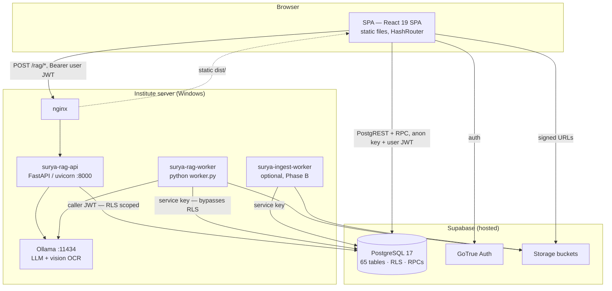

# SURYA — Engineering Architecture

_Canonical architecture reference. Supersedes the former `docs/ARCHITECTURE.md` and
`docs/STRUCTURE.md`, which now point here. Current as of 2026-08-08._

Companion documents: [system_design.md](system_design.md) (flows, state machines,
deployment), [database_design.md](database_design.md) (schema), [api_spec.md](api_spec.md)
(interfaces), [coding_standards.md](coding_standards.md) (idioms), [STACK.md](STACK.md)
(versions).

---

## 1. Architectural principles

These are load-bearing. Violating one is a defect, not a style preference.

| # | Principle | Consequence in code |
|---|---|---|
| **P1** | **The database is the only trust boundary.** The client is hostile. | RLS enabled on every table; nav and route guards are usability, not security |
| **P2** | **State transitions are server-side.** | Workflow status is never `UPDATE`d from the client — it moves via `SECURITY DEFINER` RPCs that authorize themselves |
| **P3** | **Every `SECURITY DEFINER` function opens with an authorization block.** RLS does not apply inside them, so the function *is* the boundary. | Enforced by `scripts/check_security_definer.py` in CI. Genuine exemptions (triggers, identity resolvers, `EXECUTE`-revoked helpers) are listed there with a stated reason |
| **P4** | **Client-supplied actor ids are not identity.** | Any RPC taking `p_actor_id` / `p_author_id` / `p_submitted_by` asserts it equals `auth.uid()` |
| **P5** | **Pure logic is separated from I/O.** | Domain rules live in `src/lib/**` (no React, no Supabase) and `rag/*.py` (no FastAPI); both are unit-testable without a backend |
| **P6** | **Fail closed on grounding.** | No retrieval → refusal string, zero citations. No ungrounded generation path exists |
| **P7** | **The service key never touches user input.** | `rag-api` holds the anon key and reads with the caller's JWT; only `rag-worker` holds `SUPABASE_SERVICE_KEY`, and they run as separate processes with separate env files |
| **P8** | **Schema changes are append-only and CLI-applied.** | `supabase db push`. Shipped baseline files are never edited. Dashboard SQL Editor is banned — that is how the live project drifted before the 2026-07-12 restructure |
| **P9** | **The app must run without a backend.** | `isProvisioned()` false → mock data. UI development needs no Supabase project |
| **P10** | **Adapters at the edges.** | OCR and LLM are factory-selected (`make_ocr`, `make_llm`); tests run against `NullOCR` + `FakeLLM` + `FakeDB` with no network |

---

## 2. System decomposition

SURYA is three deployable units plus a managed backend.



**Why no Node API tier.** Every rule that needs to be trustworthy is either an RLS policy
or a PostgreSQL function; putting a Node process in front of them would add a bypassable
layer and a second place for authorization to drift. The only server-side code is the AI
layer, which exists because model inference cannot run in the browser and must stay
on-premise.

---

## 3. Layered architecture

```
┌─────────────────────────────────────────────────────────────┐
│ L1  Presentation   src/pages/**, src/components/**          │  React, JSX, Tailwind
├─────────────────────────────────────────────────────────────┤
│ L2  State          src/contexts/**, src/hooks/**            │  Providers, derived state
├─────────────────────────────────────────────────────────────┤
│ L3  Domain         src/lib/**, src/utils/*.ts               │  Pure. No React, no I/O
├─────────────────────────────────────────────────────────────┤
│ L4  Data access    supabaseClient, lib/data/fetchAll,       │  PostgREST, RPC, Storage
│                    utils/dataMapper, lib/*/api|write|storage│
├─────────────────────────────────────────────────────────────┤
│ L5  Database       supabase/migrations/**                   │  RLS · RPC · triggers
├─────────────────────────────────────────────────────────────┤
│ L6  AI service     rag/api.py + rag/*.py                    │  FastAPI shell + pure core
├─────────────────────────────────────────────────────────────┤
│ L7  Workers        rag/worker.py, ingest/worker.py          │  Queue drainers
└─────────────────────────────────────────────────────────────┘
```

**Dependency rule.** Dependencies point downward only. L1 may import L2/L3; L3 imports
nothing above it and performs no I/O. A page never imports `supabaseClient` — it consumes
`useData()` (see §5.3 for the two sanctioned exceptions).

---

## 4. Folder structure

```
/
├── CLAUDE.md            Agent operating manual (conventions, do/don't)
├── DESIGN.md            Design system — read before any visual change
├── README.md            Quickstart + doc index
├── index.html           Vite entry
├── vite.config.ts       Vite + React + Tailwind 4 plugins (no tailwind.config.js)
├── tsconfig{,.app,.node}.json
├── eslint.config.js     ESLint 9 flat config
├── src/                 SPA source — see §4.2
├── supabase/
│   ├── migrations/      31 files: 8-file domain baseline + append-only additions
│   ├── migrations_archive/  Pre-2026-07-12 history; reference only, applied nowhere
│   ├── seed/            Bootstrap data every environment needs
│   ├── mock/            CSIR-AMPRI demo fixture — dev only, never production
│   ├── ops/             wipe_data.sql + apply-order runbook
│   ├── tests/           RLS positive/negative policy suites (CI `db` job)
│   └── config.toml      Versioned project config (auth, API row cap, PG version)
├── rag/                 AI service + ingestion worker (Python 3.12)
│   ├── api.py           FastAPI shell — 4 endpoints, no logic
│   ├── query_service.py Query composition (fastapi-free, testable)
│   ├── router.py        LLM route decision + catalog membership check
│   ├── retrieval.py     Tree descent, context budgeting, citations
│   ├── analytics.py     17 whitelisted structured functions + CATALOG
│   ├── worker.py        Ingestion queue drainer
│   ├── parse.py pageindex.py ocr.py llm.py db.py auth.py config.py corpus.py
│   ├── preflight.py     Pre-deploy environment + schema validation
│   ├── eval/            Gold sets, harness, local benchmark
│   └── tests/           18 offline test modules
├── ingest/              Optional capture worker (folder + IMAP), pure stdlib
├── scripts/             check_security_definer.py, IRINS sync, data importers
├── deploy/              Windows Server runbook, nginx.conf, env examples
├── docs/                This suite + roadmaps + academic artifacts
└── .claude/             Project agents, slash commands, skills
```

### 4.1 Why these files are at the root

Not aesthetics — each one is a tool's hard requirement. Migrated from the former
root-level `document.md` on 2026-08-08 and corrected.

| File / dir | Why it must be at the root |
|---|---|
| `package.json` | npm resolves `node_modules/` and `scripts` only from the directory containing it |
| `package-lock.json` | Locked beside `package.json` so `npm ci` is deterministic |
| `tsconfig*.json` | `tsc` walks up from cwd; nested configs would need explicit `--project` everywhere |
| `vite.config.ts` | Vite expects its config beside `index.html` and `package.json` |
| `index.html` | Vite's dev-server root; `<script src="/src/main.tsx">` resolves relative to it |
| `eslint.config.js` | ESLint 9 flat config is discovered from cwd upward |
| `.env` / `.env.example` | Vite loads `.env*` only from the project root for `import.meta.env.VITE_*` |
| `.gitignore` | Git respects top-level patterns only from the repo root |
| `.github/` | GitHub Actions reads `.github/workflows/*.yml` only from the default branch root |
| `CLAUDE.md` | Claude Code auto-loads it as project instructions on every cwd-rooted launch |
| `DESIGN.md` | Referenced by `CLAUDE.md` as a mandatory read before visual work |
| `README.md` | GitHub renders it as the repository landing page |
| `dist/` | Vite's default `build.outDir`; deploy copies from here |
| `supabase/` | The Supabase CLI hard-codes `supabase/migrations`, `supabase/seed`, `supabase/config.toml` |
| `docs/` | Long-form docs, kept out of `src/` so they are never bundled |
| `scripts/` | Node/Python utilities that run **outside** the Vite bundle (`scripts/irins/sync.ts`, `check_security_definer.py`) |
| `rag/`, `ingest/` | Separate Python deployables with their own venv, requirements, and pytest config — not part of the npm build |
| `deploy/` | Host-side artifacts (nginx.conf, env examples) copied to the server, not built |
| `.claude/` | Claude Code looks for project-scoped agents, skills, and commands here |
| `.planning/` | GSD workflow artifacts, by that tool's convention |

### 4.2 `src/`

| Path | Contents | Rule |
|---|---|---|
| `main.tsx` | Provider tree + `createRoot` | Only place a non-null assertion `!` is allowed |
| `App.tsx` | `HashRouter`, `ProtectedRoute`, all route declarations, lazy imports | Register every new route here |
| `pages/` | Route-level components (`export default`) | Consume `useData()`; never call Supabase directly |
| `pages/dashboards/` | One view per role | Selected by `active_role` |
| `pages/pms/`, `pages/committees/`, `pages/helpdesk/`, `pages/proposals/`, `pages/reports/`, `pages/admin/` | Module-scoped pages | |
| `components/ui/` | Shared primitives — `Button`, `Cards`, `DataTable<T>`, `Modal`, `Sheet`, `Tabs`, `Timeline`, `EmptyState`, `Skeleton`, pickers | Named exports, generic where reusable |
| `components/viz/` | Chart primitives over Recharts + palette | Raw hex allowed only in chart `fill` props |
| `components/layout/` | `Layout`, `Sidebar`, `NotificationBell` | `Sidebar` filters nav by `ACCESS_MAP` |
| `components/<module>/` | Feature components (pms, committees, calendar, dashboard, admin, proposals) | |
| `contexts/` | Nine providers; each file exports provider + `use<Name>()` hook | Throwing hook pattern, no default value |
| `hooks/` | Cross-page reusable hooks | |
| `lib/<domain>/` | Pure domain logic, one folder per domain | **No React, no Supabase imports.** Co-located `*.test.ts` |
| `utils/` | Non-React helpers, mappers, the Supabase client | camelCase filenames |
| `types/` | `index.ts` barrel + `pms.ts`, `proposal.ts`, `projectReport.ts` | |
| `constants/` | `access.ts` (`ACCESS_MAP`), `roleRoutes.ts` | Single source for page access |

---

## 5. Frontend layer

### 5.1 Provider tree (`src/main.tsx`)

```
StrictMode
└ ErrorBoundary            catches render errors app-wide
  └ ThemeProvider          class + data-density on <html>; localStorage
    └ UIProvider           DeviceType from innerWidth (<768 / 768–1023 / ≥1024)
      └ ToastProvider      transient notifications
        └ AuthProvider     Supabase session, composite roles, activeRole
          └ FeatureControlProvider   MasterAdmin runtime kill-switches
            └ DataProvider           all HR/committee/helpdesk/calendar entities
              └ PMSProvider          appraisal cycles, reports, evaluations
                └ ProposalsProvider
                  └ ProjectReportsProvider
                    └ App
```

Ordering is meaningful: `DataProvider` sits inside `AuthProvider` because its reads are
scoped by the session's active role and division; `FeatureControlProvider` sits above
`DataProvider` because `ProtectedRoute` consults it before rendering any data page.

### 5.2 Routing and access control

Three independent gates, applied in order:

1. **Navigation** — `Sidebar` renders only entries whose `ACCESS_MAP` list contains the
   active role. Cosmetic.
2. **Route guard** — `ProtectedRoute` in `App.tsx` checks, in order: loading → provisioned
   → authenticated → `mustChangePassword` → `allowedRoles` → `accessPath` feature control.
   Failures redirect to `ROLE_ROUTES[activeRole]`. Client-side, therefore advisory.
3. **RLS** — the actual gate. A user who forges their way past 1 and 2 receives an empty
   result set.

Detail routes (`/staff/:id`, `/projects/:id`, `/facilities/:uInsID`,
`/committees/:id/meetings/:meetId`) are intentionally **ungated** — they are linked from
pages open to all roles, and RLS scopes what the page can load. This is a deliberate design
decision, not an oversight.

Route ordering matters: specific paths (`/helpdesk/new`, `/proposals/new`) are declared
before parameterized siblings (`/helpdesk/:id`, `/proposals/:id`).

All non-critical routes are `React.lazy()`-loaded behind a `Suspense` skeleton, keeping the
heavy dependencies (`@react-pdf/renderer`, `xlsx`, `recharts`, force-graph) out of the
initial chunk.

### 5.3 Data access

```
Page ──useData()──> DataContext ──fetchAll()──> supabaseClient ──PostgREST──> Postgres
                          │
                          └──> dataMapper.map*Row()  raw row → typed entity
```

`fetchAll` (`src/lib/data/fetchAll.ts`) pages at `PAGE_SIZE = 1000` against the PostgREST
`max_rows = 1000` cap declared in `supabase/config.toml`. The two numbers must stay equal:
a page size above the cap makes a capped response indistinguishable from a final short one,
and paging stops early — silent truncation.

`dataMapper.ts` is the schema-translation boundary. HR tables carry quoted CamelCase column
names mirroring the source Excel (`"divCode"`, `"DOJ"`, `"CompletioDate"` — the typo is in
the schema on purpose); the mapper is where that becomes a TypeScript entity. `any` is
permitted here and in `dataMigration.ts`, nowhere else.

**The two sanctioned exceptions to "pages never touch Supabase":** module write paths
(`src/lib/<domain>/write.ts`, `api.ts`, `storage.ts`, `ticketRPCs.ts`) call `supabase.rpc()`
directly, and `src/lib/ask/client.ts` calls the RAG HTTP API. Both are L4, invoked from
pages, and are the intended shape.

### 5.4 Derived state

Every filter/aggregate in a page is wrapped in `useMemo`. This is the primary performance
pattern — pages routinely derive over thousands of rows held in context, and an unmemoized
derivation re-runs on every unrelated state change.

---

## 6. AI layer (`rag/`)

### 6.1 Shape

`api.py` is a **thin shell**: it parses the bearer token, verifies it, builds an
RLS-scoped client, and delegates. All composition lives in `query_service.py`, which
imports no FastAPI. This split exists for a concrete reason — the development host blocks
`pydantic-core`'s native DLL under WDAC, so the logic must be testable without importing
FastAPI at all. Every module in `rag/` except `api.py` runs under plain `pytest` with no
native dependency beyond PyMuPDF (`test_parse.py`, `test_worker.py`).

### 6.2 Retrieval pipeline

```
question
  └─ router.decide()          1 LLM call → {route, function, params}
       ├─ structured ─────────> analytics.run_analytics()   ← CATALOG membership enforced
       ├─ hybrid ─────────────> both, merged numbers-first
       └─ document
            └─ select_corpus()       collection stage: pick collection_indexes → entity_types
                 └─ select_docs()    document stage (only when corpus > MAX_DOCS_FLAT=8)
                      └─ descend()   recursive section pick over PageIndex nodes
                           └─ _context()   fetch doc_pages text, CONTEXT_BUDGET=8000 split evenly
                                └─ llm.answer(question, context)   context-only system prompt
```

Three model calls per question (route, pick, answer). End-to-end latency is roughly three
times single-call latency — the reason the deployment guide leads with GPU sizing.

### 6.3 Safety properties

| Property | Mechanism |
|---|---|
| No unauthorized document reads | `scoped_client(url, anon_key, caller_jwt)` — every read is RLS-scoped to the asker |
| No free-form SQL | `router.decide` rejects any `function` not in `analytics.CATALOG`; parse/validation failure falls back to the document route |
| No ungrounded answers | `traverse()` returns the refusal on empty picks, blank context, `NOT_FOUND`, or zero citations. `stream_query` buffers tokens until the accumulated text can no longer be the `NOT_FOUND` sentinel |
| No 500s from analytics | `_run_structured` swallows failures and falls through to the document path |
| Service key isolation | `api.py` reads `SUPABASE_ANON_KEY` only; there is no code path in the API process that can load a service key |

### 6.4 Ingestion pipeline (`rag/worker.py`)

`claim_pending()` (atomic) → download from Storage → `parse_pdf` (PyMuPDF, per-page OCR
fallback) → `build_tree` (TOC sections, else flat page nodes, LLM-summarized) →
`save_pages` **then** `save_index` (ordering guarantees an indexed document always has its
pages) → `mark('indexed')`. Failures are isolated per document and recorded in
`ingest_error`; `ingest_attempts` bounds retries at 3 before dead-lettering until an admin
requeues via `rag_requeue_document`. Each pass first calls `requeue_stale_processing()` to
reclaim documents a crashed worker left mid-flight, then rebuilds collection summaries if
anything was processed.

---

## 7. Worker and event layers

| Worker | Trigger | Identity | Isolation |
|---|---|---|---|
| `rag/worker.py` | Poll `documents.ingest_status='pending'` every `POLL_INTERVAL_S` | Service key | Per-document try/except; stale-claim reclamation |
| `ingest/worker.py` | Poll `WATCH_ROOT` and/or IMAP mailbox | Service key | SHA-256 content-hash dedupe; either source disabled by unsetting its env |

**There is no message bus.** "Events" in SURYA are database facts, and the event layer is
the set of append-only tables plus the triggers that write them:

| Table | Written by | Purpose |
|---|---|---|
| `pms_audit_logs` | PMS RPCs | Every appraisal action, actor, and payload |
| `audit_log` | `audit_row_change` trigger | Committees, meetings, action items, tickets, calendar, holidays |
| `ticket_events` | Helpdesk RPCs | Ticket lifecycle |
| `proposal_status_history`, `project_report_history` | Workflow RPCs | Status transitions with payload |
| `query_log` (+ `route_labels`) | RAG API | Every question, route, latency, citations, feedback |
| `import_events` | Import flow | Who imported what, when |
| `irins_sync_log` | Sync script | External profile sync outcomes |

Two triggers produce genuine control-flow events rather than records:
`pms_check_evaluation_complete` advances a report when its last evaluation completes, and
`handle_new_auth_user` provisions `user_roles` + `user_profiles` on every signup.

---

## 8. Dependency injection

No DI container. Three idiomatic mechanisms, one per runtime:

**React — provider injection.** Contexts are the injection points. The
`createContext<T | undefined>(undefined)` + throwing `use<Name>()` pattern makes a missing
provider a loud startup failure rather than a silent `undefined`.

**Python — factory selection by config.**
```python
ocr = make_ocr(cfg.ocr_backend)          # null | tesseract | ollama
llm = make_llm(cfg.llm_backend, ...)     # fake | openllm  (+ LLM_PROVIDER presets)
db  = SupabaseDB(cfg)                    # tests substitute FakeDB
```
Tests construct the fakes directly; there is no monkeypatching of module globals.

**Closure injection for scoped I/O.** `make_fetch_texts(client)` returns a
`fetch_texts(spans)` closure carrying the caller's RLS-scoped client. `retrieval.traverse`
takes it as a parameter and therefore knows nothing about Supabase — which is what makes
the retrieval tests pure.

---

## 9. Configuration

| Surface | Source | Validation |
|---|---|---|
| SPA | `.env` → `VITE_SUPABASE_URL`, `VITE_SUPABASE_ANON_KEY`, `VITE_RAG_URL` | Absent URL/key → mock mode. Absent `VITE_RAG_URL` → Ask SURYA throws a clear error |
| SPA fallback | `localStorage` `surya_supabase_url` / `surya_supabase_anon_key` via the Setup Wizard | Dev convenience; deprecated for production |
| RAG worker | `C:\surya\env\rag-worker.env` — includes `SUPABASE_SERVICE_KEY` | `config.load_config` fails fast on any missing `REQUIRED` key |
| RAG API | `C:\surya\env\rag-api.env` — anon key only | Same, plus `preflight.py --api` |
| Supabase project | `supabase/config.toml` — auth policy, `max_rows`, PG major version | `supabase config push`; versioned so dashboard clicks cannot drift |
| Feature flags | `feature_controls` table, edited at `/admin/features` | Runtime, per-feature and per-role, no redeploy |

Runtime tunables worth knowing: `RAG_ROUTE_TIMEOUT_S` / `RAG_PICK_TIMEOUT_S` /
`RAG_ANSWER_TIMEOUT_S` (defaults 10/20/60 s assume a GPU; a CPU-only host must raise them
or every query times out), `RAG_SUMMARIZE_TIMEOUT_S`, `OCR_BASE_URL` / `OCR_MODEL` (keeps
page images on a local vision model even when the answering LLM is a hosted API),
`POLL_INTERVAL_S`, `BATCH_SIZE`, `CORS_ORIGINS`.

---

## 10. Security architecture

**Authentication.** Supabase Auth (GoTrue), email + password. Session validated via
`supabase.auth.getSession()` — never from `localStorage`, which is spoofable. First login
after admin provisioning is forced through `/change-password`;
`secure_password_change` is enforced in `config.toml`, and `clear_must_change_password`
refuses when the password hash cannot be verified.

**Authorization, in four layers.**
1. `user_roles` composite rows define what a user *is*; `user_profiles.active_role` defines
   what they are *acting as*, validated by `user_profiles_validate_active_role`.
2. `ACCESS_MAP` gates pages.
3. RLS policies gate rows, using `caller_*` helpers (`caller_has_role`, `caller_division`,
   `caller_staff_id`, `caller_is_admin`, `caller_sees_all_personnel`, …) that are
   `SECURITY DEFINER` specifically to avoid policy recursion.
4. RPCs gate transitions.

**Grants are part of the schema.** RLS is consulted only after a role holds table
privileges, so a policy without a `GRANT` is dead code — a defect this project shipped and
caught. `20260726000004_baseline_grants.sql` owns grants and asserts its own outcome. Never
add a blanket `GRANT ALL` elsewhere; it silently undoes the column-level narrowings on
`user_roles` / `user_profiles`.

**Two SQL hazards this codebase has been bitten by, documented so they are not repeated:**
- Wrap `IF NOT (...)` authorization guards in `COALESCE(..., false)` when any operand is
  nullable. `assigned_to = auth.uid()` on an unassigned ticket is NULL, the OR-chain
  collapses to NULL, `NOT NULL` is NULL, and `IF NULL THEN` never fires — the guard reads
  correctly and authorizes everyone. RLS `USING` clauses are safe (NULL is false there); it
  is plpgsql `IF` that bites.
- `anon` must stay out of default ACLs, and RPC `EXECUTE` must stay explicitly locked
  (`20260726000005`, `20260726000006`).

**Document confidentiality** is a four-tier ladder (`institute` / `division` / `owner` /
`confidential`) evaluated by `documents_can_read`, mirrored onto `storage.objects` policies
so a Storage URL is unreadable without a corresponding readable registry row.

**CI as the enforcement mechanism.** The `db` job boots a real Supabase stack (Postgres +
GoTrue + Storage), applies all migrations and seeds, and runs `supabase/tests/rls_*.sql`.
This exists because the 2026-07-25 audit found a full privilege-escalation path in three
lines of SQL that a 652-test TypeScript suite could never have caught.

---

## 11. Observability

| Signal | Where | Surfaced at |
|---|---|---|
| Client errors | `ErrorBoundary`, `src/utils/logger.ts` | Browser console; `EmptyState` `error` variant in-page |
| Query quality | `query_log` (route, function, params, latency, citations, refusal reason, `catalog_version`) + `feedback` + `route_labels` | `/admin/rag`; `rag/eval/run_eval.py` |
| Ingestion health | `documents.ingest_status` / `ingest_error` / `ingest_attempts`, `doc_indexes.built_at` | `/admin/rag` |
| Data freshness | `import_events`, `DataFreshnessLedger`, `DataHealthDigest` | `/data`, dashboards |
| Workflow audit | `pms_audit_logs`, `audit_log`, `ticket_events`, `*_history` | `/pms/audit`, `/audit` merged timeline |
| Pre-deploy readiness | `rag/preflight.py --worker` / `--api` | Deploy checklist; each `[FAIL]` names the migration or action needed |

Answers are stamped with `catalog_version` (`RAG_BUILD_SHA`, else git short SHA, else
`dev`), so a logged answer can be traced to the code that produced it.

**Honest gap:** there is no centralized log aggregation, metrics endpoint, or alerting.
Worker output goes to service logs; failures surface in the database and in `/admin/rag`.
Appropriate for a single-server institutional deployment; it would not survive horizontal
scaling.

---

## 12. Extension points

| To add… | Do this |
|---|---|
| A page/route | `src/pages/<Page>.tsx` → lazy import + `<Route>` in `App.tsx` → `ACCESS_MAP` + `FEATURE_LABELS` entry in `src/constants/access.ts` → nav entry in `Sidebar` |
| A domain entity | The five-file dance: type in `src/types/index.ts` → mock in `mockData.ts` → mapper in `dataMapper.ts` → load in `DataContext.tsx` → import mapping in `dataMigration.ts`; plus a migration with RLS |
| A workflow transition | New `SECURITY DEFINER` RPC in a new timestamped migration, opening with an authorization block; call it from `src/lib/<domain>/write.ts` — never `UPDATE` the status column |
| A structured AI question | One function in `rag/analytics.py` + one line in `_FUNCTIONS` + one description in `CATALOG`. The description is the routing prompt — write it as the question a user would ask |
| An OCR or LLM backend | New class in `rag/ocr.py` / `rag/llm.py` + a branch in `make_ocr` / `make_llm`; keep the existing method signature |
| A document source | New source module in `ingest/` yielding `(name, bytes, tag)`; `sink.land_file` handles dedupe and routing |
| A UI primitive | `src/components/ui/<Name>.tsx`, named export, semantic tokens only — read [DESIGN.md](../../DESIGN.md) first |
| A runtime kill-switch | Nothing to build: any `ACCESS_MAP` key is already toggleable per-role at `/admin/features` |

---

## 13. Known architectural debt

| Item | Impact | Why it stands |
|---|---|---|
| HR column casing (`"divCode"`, `"DOJ"`, `"CompletioDate"`) | Quoted CamelCase everywhere; mapper layer required | Renaming is a coordinated DB + code migration; the schema deliberately mirrors source Excel headers |
| Name-string joins (`projects."PrincipalInvestigator"`, `phd_students."SupervisorName"`) | Fuzzy-matched in code (`staffNameMatchesAuthor`, `relations.ts`) rather than FK-enforced | Source data has no staff IDs in those columns |
| `EmptyState` `error` variant only on Projects / HumanCapital / PhDTracker | Other pages fail silently to an empty list | Rolled out per page as touched |
| Admin-only routes not code-split separately | Non-admin sessions still ship those chunks | Deferred; measured impact small |
| One-level PageIndex trees | Section pick is flatter than the design allows | Tracked as P1 in [IMPROVEMENT-PROPOSALS.md](../roadmap/sources/IMPROVEMENT-PROPOSALS.md) |
| No log aggregation / metrics | Diagnosis is manual | Single-server deployment; revisit if scaled |
