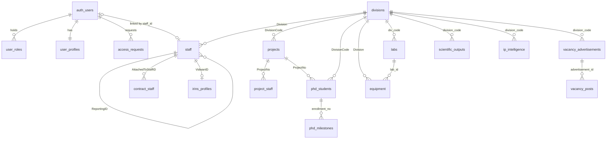
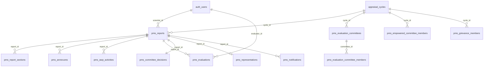
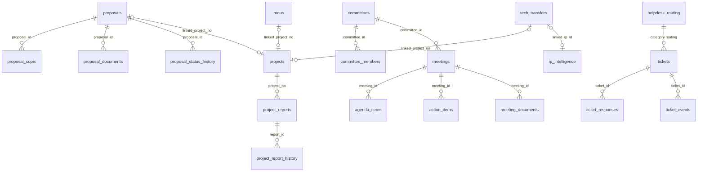
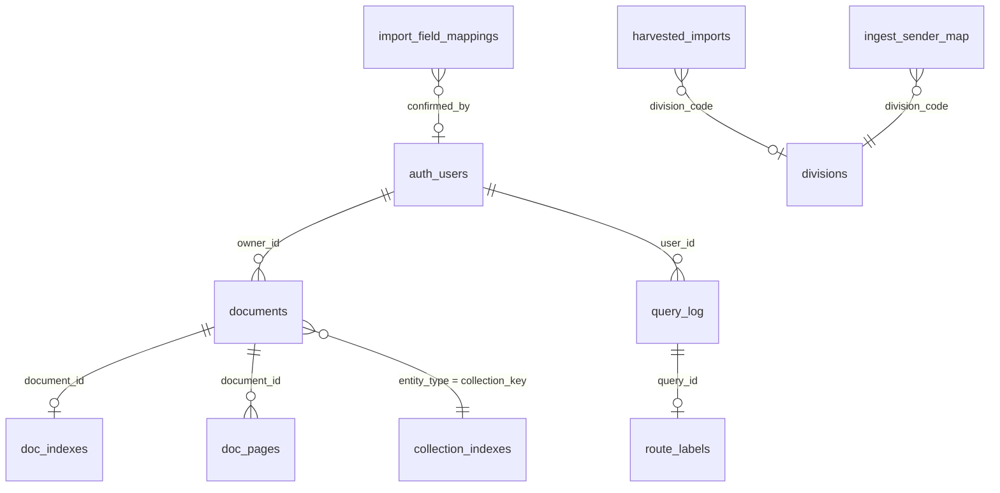

# SURYA — Database Design

_Complete schema reference for the PostgreSQL 17 database. Supersedes `docs/DATA-MODEL.md`,
which now points here. Current as of 2026-08-08 (31 migrations, 65 tables in `public`)._

Companions: [api_spec.md](api_spec.md) (how the schema is called),
[system_design.md](system_design.md) (state machines),
[architecture_addendum.md](architecture_addendum.md) (why it is shaped this way).

---

## 1. Conventions

**Two naming worlds, deliberately.**

| Domain | Casing | Reason |
|---|---|---|
| HR analytics (`divisions`, `staff`, `projects`, `project_staff`, `phd_students`, `equipment`, `contract_staff`) | Quoted **CamelCase** — `"divCode"`, `"DOJ"`, `"CompletioDate"` | Columns mirror the source Excel headers one-for-one. Import is a rename map, not a transformation. `"CompletioDate"` is a typo **in the source**, preserved on purpose |
| Everything else (PMS, committees, helpdesk, proposals, calendar, documents, RAG) | `snake_case` | Fresh schema, no legacy source |

The mapper layer (`src/utils/dataMapper.ts`) is where quoted CamelCase becomes a TypeScript
entity. Renaming the HR columns is a coordinated DB-migration + code-change task and is
out of scope; see [architecture_addendum.md §13](architecture_addendum.md#13-known-architectural-debt).

**Dates.** HR tables store dates as `text` because the source spreadsheets carry three
formats (`28.12.1970`, `28/12/1970`, `1970-12-28`). `parseDate` (`src/utils/dateUtils.ts`)
and `analytics._parse_date` both handle all three. Every non-HR table uses real `date` /
`timestamptz`.

**Keys.** HR tables use natural text keys from the source data (`staff."ID"`,
`projects."ProjectID"`, `divisions."divCode"`). Everything else uses
`uuid PRIMARY KEY DEFAULT gen_random_uuid()`.

**RLS is mandatory.** Every table in `public` has `ENABLE ROW LEVEL SECURITY` and at least
one explicit policy. A new table without both is a defect.

**Grants are schema.** RLS is consulted only after the role holds table privileges, so a
policy without a `GRANT` is dead code. `20260726000004_baseline_grants.sql` owns grants and
asserts its own outcome. Never add a blanket `GRANT ALL` elsewhere — it silently undoes the
column-level narrowings on `user_roles` / `user_profiles`.

---

## 2. Entity relationship overview

Sixty-five tables in eight domains. The diagram shows the load-bearing relationships;
per-table detail follows in §3.

### 2.1 Identity and HR core

### 2.2 PMS

### 2.3 Research operations and institutional workflow

### 2.4 Documents, RAG, and ingestion

---

## 3. Tables

Notation: **PK** primary key · **FK** foreign key · **U** unique · `?` nullable.

### 3.1 Identity and RBAC — `20260712000002_auth_rbac.sql`

#### `user_roles` — composite roles
| Column | Type | Notes |
|---|---|---|
| `user_id` | `uuid` | **PK** (composite), FK → `auth.users` ON DELETE CASCADE |
| `role` | `text` | **PK** (composite). CHECK ∈ the 14 roles |
| `division_code` | `text?` | NULL for cross-division roles |
| `must_change_password` | `boolean` | default `true` |

Composite PK `(user_id, role)` is what makes multi-role possible: one user can hold
`Scientist` and `DivisionHead` simultaneously.
**Index:** `user_roles_division_code_idx (division_code)`.
**RLS:** own rows readable; admins read all; **writes via `admin_set_user_roles` only**. The
grant is column-narrowed — this table is the privilege-escalation surface, and a blanket
`GRANT ALL` here re-opens it.

#### `user_profiles` — active role and settings
| Column | Type | Notes |
|---|---|---|
| `user_id` | `uuid` | **PK**, FK → `auth.users` |
| `email` | `text?` | copied from `auth.users` |
| `must_change_password` | `boolean` | default `true` |
| `active_role` | `text?` | drives the dashboard; validated against held roles by `user_profiles_validate_active_role` |
| `last_seen_at` | `timestamptz?` | |
| `preferences` | `jsonb` | default `{}`; merged via `merge_user_preferences` (added `20260714000001`) |
| `password_fingerprint` | `text?` | lets `clear_must_change_password` refuse an unchanged password (added `20260725000001`) |

**Trigger:** `handle_new_auth_user` on `auth.users` INSERT creates the `DefaultUser` role
row and this profile row.

#### `access_requests`
| Column | Type | Notes |
|---|---|---|
| `id` | `uuid` | **PK** |
| `user_id` | `uuid` | FK → `auth.users` CASCADE |
| `email`, `justification` | `text` | |
| `requested_roles` | `text[]` | |
| `requested_division` | `text?` | |
| `status` | `text` | `PENDING` \| `APPROVED` \| `REJECTED` |
| `review_note` | `text?` | |
| `reviewed_by` | `uuid?` | FK → `auth.users` |
| `reviewed_at`, `created_at` | `timestamptz` | |

**Index:** `access_requests_one_pending` — **partial unique** on `(user_id) WHERE status='PENDING'`.
One open request per user, enforced by the database rather than the form.

#### `pms_audit_logs`
`(id uuid PK, user_id uuid, action text, entity_type text, entity_id uuid, details jsonb, created_at)`.
Append-only; written by RPCs only. **Index:** `(entity_type, entity_id)`.

### 3.2 HR core — `20260712000003_hr_core.sql`

> Quoted CamelCase throughout. Cross-table references are **conventional, not FK-enforced**,
> because the source spreadsheets contain names rather than keys.

#### `divisions`
`"divCode"` **PK** · `"divName"` · `"divDescription"` · `"divResearchAreas"` · `"divHoD"` ·
`"divHoDID"` (→ `staff."ID"`) · `"divSanctionedstrength"` `integer` ·
`"divCurrentStrength"` `integer` · `"divStatus"`.

#### `staff`
`"ID"` **PK** · `"LabCode"` · `"EmployeeType"` · `"Name"` · `"Designation"` · `"Group"` ·
`"Division"` (→ `divisions."divCode"`) · `"DoAPP"` · `"DOJ"` · `"DOB"` · `"Cat"` ·
`"AppointmentType"` · `"Level"` · `"CoreArea"` · `"Expertise"` · `"Email"` · `"Ext"` ·
`"VidwanID"` · `"ReportingID"` (self-reference) · `"HighestQualification"` · `"Gender"`.
Plus `user_id uuid?` FK → `auth.users` (added `20260725000005`) — the link that lets RLS
scope a logged-in user to their own staff record.

#### `projects`
`"ProjectID"` **PK** · `"ProjectNo"` · `"ProjectName"` · `"FundType"` · `"SponsorerType"` ·
`"SponsorerName"` · `"ProjectCategory"` · `"ProjectStatus"` · `"StartDate"` ·
`"CompletioDate"` *(sic)* · `"SanctionedCost"` · `"UtilizedAmount"` ·
`"PrincipalInvestigator"` (name string) · `"DivisionCode"` · `"Extension"` ·
`"ApprovalAuthority"`. Plus `pi_staff_id text?` FK → `staff."ID"` — the resolved key
alongside the legacy name string.

> `"SanctionedCost"` / `"UtilizedAmount"` are `text`, not numeric — the source carries
> "12.5 lakhs", "—", and blanks. `parseCost` (`src/utils/parseCost.ts`) and
> `analytics._num` normalize; `analytics._recorded` distinguishes "zero spent" from
> "figure not supplied", which is not the same answer.

#### `project_staff`
`"id"` **PK** · `"StaffName"` · `"Designation"` · `"RecruitmentCycle"` ·
`"DateOfJoining"` · `"DateOfProjectDuration"` · `"ProjectNo"` · `"PIName"` · `"DivisionCode"`.

#### `phd_students`
`"EnrollmentNo"` **PK** · `"StudentName"` · `"Specialization"` · `"SupervisorName"` ·
`"CoSupervisorName"` · `"FellowshipDetails"` · `"CurrentStatus"` · `"ThesisTitle"` ·
`"ProjectNo"` · `"DivisionCode"`. Plus `supervisor_staff_id` / `cosupervisor_staff_id`
`text?` FK → `staff."ID"` ON DELETE SET NULL — added `20260718000003` so a supervisor can
see their own scholars under RLS.

#### `phd_milestones`
`(id uuid PK, enrollment_no text, milestone text, due_date date?, completed_date date?, remarks text?, created_at)`.
`milestone` ∈ Joining · Coursework · Comprehensive Exam · Registration · Synopsis Submission
· Thesis Submission · Viva Voce · Degree Awarded. **U** `(enrollment_no, milestone)`.
**Index:** `(enrollment_no)`.

#### `equipment`
`"UInsID"` **PK** · `"Name"` · `"EndUse"` · `"Division"` · `"IndenterName"` ·
`"OperatorName"` · `"Location"` · `"WorkingStatus"` · `"Movable"` ·
`"RequirementInstallation"` · `"Justification"` · `"Remark"`, plus typed operational
columns: `instrument_code`, `serial_number`, `manufacturer`, `year_of_manufacture int`,
`lab_id uuid` FK → `labs`, `owner_user_id uuid` FK → `auth.users`, `amc_end_date date`,
`purchase_cost numeric(14,2)`, `procurement_date date`.
**Indexes:** `(owner_user_id)`, `(lab_id)`, `(amc_end_date)`.

#### `labs`
`(id uuid PK, lab_code text U, lab_name text, div_code text FK → divisions, created_at)`.

#### `contract_staff`
`"id"` **PK** · `"Name"` · `"Designation"` · `"Division"` · `"DateOfJoining"` ·
`"ContractEndDate"` · `"LabCode"` · `"DateOfBirth"` · `"AttachedToStaffID"` (→ `staff."ID"`).

#### `scientific_outputs`
`(id text PK, title text, authors text[], journal text, year int, doi text?, impact_factor float?, citation_count int?, division_code text)`.

#### `ip_intelligence`
`(id text PK, title text, type text, status text, filing_date text, grant_date text?, inventors text[], division_code text)`.
`type` ∈ Patent · Copyright · Design · Trademark. `status` ∈ Filed · Published · Granted.

#### `mous`
`(id uuid PK, partner_name, partner_type, purpose, signed_date date?, valid_until date?, status, division_code?, linked_project_no?, remarks?, created_at, updated_at)`.
`partner_type` ∈ Academic · Industry · Government · International · Other.
`status` ∈ Active · Expired · Under Renewal · Terminated.
**Indexes:** `(status)`, `(valid_until)` — the second powers the "expiring within 90 days" query.

#### `tech_transfers`
`(id uuid PK, technology_title, licensee, licensee_type, agreement_type, agreement_date date?, value_lakhs numeric(12,2) ≥0, status, linked_project_no?, linked_ip_id?, division_code?, remarks?, created_at, updated_at)`.
`status` ∈ Under Negotiation · Signed · Active · Completed · Terminated.
**Indexes:** `(status)`, `(division_code)`.

#### `vacancy_advertisements` / `vacancy_posts`
Advertisement: `(id text PK, title, advt_no?, issue_date date?, division_code FK, status, description?, closing_date date?, created_by uuid FK, created_at, staff_category, drive_stage)`.
`status` ∈ Draft · Open · Published · Closed · Cancelled.
`staff_category` ∈ Permanent · Project.
`drive_stage` ∈ Advertised · Applications Closed · Screening · Interviews · Selection ·
Offers Issued · Joined · Closed.
Post: `(id text PK, advertisement_id FK CASCADE, post_code?, designation?, discipline?, no_of_positions int?, pay_level?, age_limit?, qualifications?, status?, created_at)`.
**Indexes:** `vacancy_advertisements(status)`, `vacancy_posts(advertisement_id)`.

#### `irins_profiles` / `irins_sync_log`
`irins_profiles(vidwan_id text PK, profile_data jsonb, synced_at)` — external scientist
profile cache keyed by `staff."VidwanID"`.
`irins_sync_log(id bigserial PK, triggered_by, started_at, completed_at?, status, total_scientists, succeeded, failed, error_details jsonb?)`.
**Index:** `(started_at DESC)`.

### 3.3 PMS — `20260712000004_pms.sql` (+ `20260726000001_pms_senior_track.sql`)

#### `appraisal_cycles`
`(id uuid PK, name text, start_date date, end_date date, status text, created_at)`.
`status` ∈ `OPEN` \| `CLOSED` \| `ARCHIVED`. All four PMS deadlines derive from
`extract(year FROM end_date)`.

#### `pms_reports`
| Column | Type | Notes |
|---|---|---|
| `id` | `uuid` | **PK** |
| `cycle_id` | `uuid` | FK → `appraisal_cycles` ON DELETE **RESTRICT** — a cycle with reports cannot be deleted |
| `scientist_id` | `uuid` | → `auth.users` |
| `status` | `text` | 7 values, see [system_design §4.1](system_design.md#41-pms-report--pms_reportsstatus) |
| `track` | `text` | `STANDARD` \| `ANNEXURE_I` \| `ANNEXURE_II`, default `STANDARD`; set by the `pms_set_report_track` trigger from designation |
| `period_from`, `period_to` | `date?` | lifted from the wizard's period section |
| `self_score` | `integer?` | CHECK 0–100 |
| `submitted_at` | `timestamptz?` | |
| `signature_url` | `text?` | |
| `previous_pms_submitted_on_time` | `boolean?` | Part I |
| `previous_pms_submission_date` | `date?` | Part I |
| `duty_days` | `integer?` | CHECK ≥ 0; < 90 blocks appraisal |
| `system_remark` | `text?` | auto-set on `NOT_ASSESSED` / non-submission |
| `score_communicated_at` | `timestamptz?` | anchors the 15-day representation window |
| `non_submission_certificate_path` | `text?` | |
| `created_at`, `updated_at` | `timestamptz` | |

**U** `(cycle_id, scientist_id)`. **Indexes:** `(cycle_id)`, `(scientist_id)`.
**Triggers:** `pms_set_report_track`, `pms_set_updated_at`, `pms_block_locked_cycle_reports`.

#### `pms_report_sections`
`(id uuid PK, report_id FK CASCADE, section_key text, data jsonb, updated_at)`, **U**
`(report_id, section_key)`. One JSONB blob per proforma section. Section keys are declared
in `src/lib/pms/constants.ts` — 15 for the standard track, ~25 for Annexure-I, and a
separate set for Annexure-II. JSONB is the right shape here: the proformas are
government-defined forms that change between guideline revisions, and modelling each as
columns would mean a migration per revision.

#### `pms_annexures`
`(id uuid PK, report_id FK CASCADE, file_name, file_path, file_size bigint, mime_type, uploaded_at)`.
`file_path` is a Supabase Storage path in the `annexures` bucket, gated by
`pms_owns_report_path` / `pms_can_read_report_path`.

#### `pms_evaluation_committees` / `pms_evaluation_committee_members`
Committee: `(id uuid PK, name, description?, cycle_id FK RESTRICT, tier text?, created_at)`,
**U** `(name, cycle_id)`. `tier` ∈ `I` (Sci B/C/D) \| `II` (E) \| `III` (F).
Member: `(id uuid PK, committee_id FK CASCADE, user_id uuid, role text)`, **U**
`(committee_id, user_id)`. `role` ∈ `REPORTING_OFFICER` \| `REVIEWING_OFFICER` \| `EC_MEMBER`.
Validity — odd member count with all three roles present — is `pms_committee_panel_valid`.

#### `pms_empowered_committee_members`
`(id uuid PK, cycle_id FK CASCADE, user_id uuid, is_chairman boolean)`, **U** `(cycle_id, user_id)`.
Valid = 3, 5, or 7 ordinary members plus exactly one Chairman (`pms_empowered_committee_valid`).

#### `pms_grievance_members`
`(id uuid PK, cycle_id FK CASCADE, user_id uuid)`, **U** `(cycle_id, user_id)`. Five-member
independent Grievance Redressal Committee per cycle.

#### `pms_evaluations`
`(id uuid PK, report_id FK RESTRICT, evaluator_id uuid, status text, scores jsonb, comments text?, total_score int? CHECK 0–100, reasons_for_outstanding?, reasons_below_threshold?, suggestions_for_improvement?, created_at, updated_at)`,
**U** `(report_id, evaluator_id)`. `status` ∈ `PENDING` \| `IN_PROGRESS` \| `COMPLETED`.
**Index:** `(report_id)`.
**Trigger:** `pms_check_evaluation_complete` — when the last evaluation for a report reaches
`COMPLETED`, the report advances to `EMPOWERED_COMMITTEE_REVIEW`.

#### `pms_committee_decisions`
`(id uuid PK, report_id FK RESTRICT **U**, decided_by uuid, final_score int? CHECK 0–100, justification text CHECK length ≥ 50, reasons_for_outstanding?, reasons_below_threshold?, suggestions_for_improvement?, pen_picture jsonb, created_at)`.
`pen_picture` (added `20260726000001`) carries the categorical outcome for Annexure-I/II
reports, which have no numeric score.

#### `pms_awp_activities`
`(id uuid PK, report_id FK CASCADE, nature_of_activity text, role text, time_committed_percentage numeric(5,2) CHECK 0–100, milestones jsonb, created_at, updated_at)`.
Part V Annual Work Plan; standard track only. **Index:** `(report_id)`.

#### `pms_representations`
`(id uuid PK, report_id FK CASCADE **U**, scientist_id uuid, grounds text CHECK length ≥ 20, submitted_at, status text, resolution text?, resolved_by uuid?, resolved_at?)`.
`status` ∈ `PENDING` \| `RESOLVED`. Written only by
`pms_submit_representation` / `pms_resolve_representation`.

#### `pms_notifications`
`(id uuid PK, user_id uuid, type, title, body, report_id FK CASCADE?, read boolean, created_at)`.
INSERT via `SECURITY DEFINER` RPCs only. **Index:** `(user_id)`.

### 3.4 Committees and helpdesk — `20260712000005_committees_helpdesk.sql`

#### `committees`
`(id uuid PK, name, committee_type, mandate, chairperson_id text → staff."ID", secretary_id text → staff."ID", status, formed_date date, created_at)`.
`committee_type` ∈ Standing · AdHoc · Review · Advisory. `status` ∈ Active · Inactive.
**Index:** `(status)`.

#### `committee_members`
`(id uuid PK, committee_id FK CASCADE, staff_id text, role text)`.
`role` ∈ Member · Invitee · ExternalExpert. **Indexes:** `(committee_id)`, `(staff_id)`.

#### `meetings`
`(id uuid PK, committee_id FK CASCADE, meeting_date date, venue, title, summary, status, teams_url?, pamphlet_url?, created_at)`.
`status` ∈ Scheduled · Completed · Cancelled. **Indexes:** `(committee_id)`, `(meeting_date)`.

#### `agenda_items`
`(id uuid PK, meeting_id FK CASCADE, sequence int, description, proposed_by text, status)`.
`status` ∈ Pending · Discussed · Deferred. **Index:** `(meeting_id)`.

#### `action_items`
`(id uuid PK, meeting_id FK SET NULL?, source text, task, assigned_to text, deadline date, status, completed_at?, notes)`.
`source` ∈ meeting · manual. `status` ∈ Pending · InProgress · Completed.
**Indexes:** `(meeting_id)`, `(assigned_to)`, `(status)`.

#### `meeting_documents`
`(id uuid PK, meeting_id FK CASCADE, file_name, storage_path, uploaded_at)`. **Index:** `(meeting_id)`.

#### `tickets`
`(id uuid PK, token text U, subject, category, urgency, description, submitted_by, assigned_to?, status, created_at, updated_at, resolved_at?)`.
Actor columns migrated `text` → `uuid` in `20260725000004` so the audit actor is a real
identity rather than a client-supplied staff string.
**Indexes:** `(submitted_by)`, `(assigned_to)`, `(status)`, `(token)`.

#### `ticket_responses` / `ticket_events`
Responses: `(id uuid PK, ticket_id FK CASCADE, author_id, message, created_at)`.
Events: `(id uuid PK, ticket_id FK CASCADE, event_type, actor_id, details jsonb, created_at)`.
`event_type` ∈ Created · Assigned · StatusChanged · Resolved · Closed · Reopened.
**Indexes:** `(ticket_id)` on both.

#### `helpdesk_routing`
`(id uuid PK, category text U, target_type text, target_id text)`.
`target_type` ∈ division · role; `target_id` is a `divisions."divCode"` or a role name.
Seeded by `supabase/seed/01_helpdesk_routing.sql`. **Index:** `(category)`.

#### `audit_log`
`(id uuid PK, entity_type, entity_id uuid, action, actor_id text, changes jsonb, created_at)`.
`entity_type` ∈ committee · meeting · action_item · ticket · ticket_response ·
calendar_event · holiday. `action` ∈ created · updated · deleted · status_changed.
Written by the `audit_row_change` trigger. **Indexes:** `(entity_type, entity_id)`, `(created_at)`.

### 3.5 Proposals and progress reports — `20260712000006_proposals_reports.sql`

#### `proposals`
| Group | Columns |
|---|---|
| Identity | `id uuid PK`, `proposal_code text U` (assigned by `proposals_set_code` trigger), `title`, `acronym?` |
| Classification | `domain_theme`, `fund_type`, `sponsor_type`, `sponsor_name`, `project_category` |
| Plan | `proposed_start_date date`, `proposed_duration_months int CHECK > 0`, `requested_budget numeric(14,2) CHECK ≥ 0` |
| People | `pi_user_id uuid FK → auth.users`, `pi_name`, `division_code` |
| Content | `abstract`, `problem_statement`, `objectives`, `expected_outcomes`, `current_trl smallint? CHECK 1–9`, `target_trl smallint? CHECK 1–9` |
| Workflow | `status` (10 values), `review_body?`, `review_sent_date date?`, `revision_notes?`, `rejection_reason?` |
| Outcome | `sanctioned_amount numeric(14,2)?`, `sanction_date date?`, `om_number?`, `om_date date?`, `linked_project_no?`, `archived boolean` |
| Audit | `created_at`, `updated_at`, `submitted_at?`, `created_by FK`, `last_status_change_by FK?`, `last_status_change_at?` |

**Indexes:** `(pi_user_id)`, `(division_code)`, `(status)`, `(created_at DESC)`.

#### `proposal_copis` / `proposal_documents` / `proposal_status_history`
Co-PIs: `(proposal_id FK CASCADE, staff_id text, staff_name text)` — **PK** `(proposal_id, staff_id)`.
Documents: `(id uuid PK, proposal_id FK CASCADE, doc_type text, storage_path, file_name, file_size int?, uploaded_at, uploaded_by FK)`.
`doc_type` ∈ `signed_proposal` \| `om_document`. **Index:** `(proposal_id)`.
History: `(id bigserial PK, proposal_id FK CASCADE, from_status?, to_status, payload jsonb?, changed_by FK, changed_at)`.

#### `project_reports`
`(id uuid PK, project_no text, project_name text, division_code?, period_type, period_label, due_date date?, status, objectives_progress, milestones, expenditure_summary, outcomes, remarks, review_notes?, reviewed_by FK?, reviewed_at?, submitted_by FK, submitted_at?, created_at, updated_at)`.
`period_type` ∈ `Q` \| `H` \| `Y`. `status` ∈ `DRAFT` \| `SUBMITTED` \| `UNDER_REVIEW` \|
`REVISION_REQUESTED` \| `REVIEWED`. **Index:** `(project_no)`.

#### `project_report_history`
`(id uuid PK, report_id FK CASCADE, from_status?, to_status, payload jsonb, changed_by FK, changed_at)`.

### 3.6 Calendar and recruitment — `20260712000007_calendar_recruitment.sql`

#### `calendar_events`
`(id uuid PK, title, event_date date, event_kind, location, teams_url?, pamphlet_url?, description, visibility, division_code?, created_by FK, created_at, updated_at)`.
`event_kind` ∈ Custom · Pamphlet · Announcement. `visibility` ∈ OrgWide · Division · Personal.
**Constraint** `calendar_events_division_required`: `visibility <> 'Division' OR division_code IS NOT NULL`
— a division event cannot exist without a division, enforced by the database rather than
the form.
Calendar also **derives** events that are not rows: meeting dates, PMS deadlines, MoU
expiries, AMC expiries and contract ends are computed by `src/lib/calendar/deriveEvents.ts`.

#### `holidays`
`(id uuid PK, holiday_date date, name, holiday_type, year int, created_by FK?, created_at)`,
**U** `(holiday_date, name)`. `holiday_type` ∈ Gazetted · Restricted · Institute.

### 3.7 Documents and RAG — `20260712000008_rag_documents.sql`

#### `documents` — unified registry and ingest queue
| Column | Type | Notes |
|---|---|---|
| `id` | `uuid` | **PK** |
| `entity_type` | `text` | `proposal` \| `meeting` \| `pms_report` \| `publication` \| `staff_profile` \| `project_report` \| … Doubles as the RAG **collection key** |
| `entity_id` | `text` | parent PK as text — HR and PMS key types differ |
| `doc_type` | `text` | module subtype (`signed_proposal`, `annexure`, `minutes`) |
| `title`, `file_name`, `mime_type` | `text` | |
| `storage_bucket`, `storage_path` | `text` | Files stay in their module buckets |
| `file_size` | `bigint` | |
| `owner_id` | `uuid` | FK → `auth.users` |
| `division_code` | `text?` | |
| `access_tier` | `text` | `institute` \| `division` \| `owner` \| `confidential` |
| `ingest_status` | `text` | `pending` \| `processing` \| `indexed` \| `failed` \| `skipped` |
| `ingest_error` | `text?` | |
| `ingest_attempts` | `int` | bounds retries at 3, then dead-letters |
| `content_hash` | `text?` | SHA-256, added by `20260719000002` for capture dedupe |
| `created_at` | `timestamptz` | |

**Indexes:** `(entity_type, entity_id)`; **partial** `(created_at) WHERE ingest_status='pending'`
— the queue index, so the worker's claim scans only pending rows;
**unique** `(storage_bucket, storage_path)` — one registry row per stored object.

#### `doc_indexes`
`(document_id uuid PK FK CASCADE, tree jsonb, model text, page_count int, built_at)`.
One PageIndex tree per document. `model` records which LLM built it, so
`worker.py --reindex-model` can requeue everything not built by the current model.

#### `doc_pages`
`(document_id uuid FK CASCADE, page int, text text)` — **PK** `(document_id, page)`.
The evidence layer: `retrieval._context` fetches the picked nodes' page spans from here.

#### `query_log`
`(id uuid PK, user_id uuid FK DEFAULT auth.uid(), question, mode, answer, citations jsonb, feedback smallint? CHECK ∈ (-1,1), latency_ms int?, created_at)`,
plus decision-trace columns from `20260714000002`: `route`, `function_name`,
`function_params jsonb`, `refusal_reason`, `catalog_version`.
**Index:** `(user_id, created_at DESC)`. RLS: own rows only.

#### `collection_indexes`
`(collection_key text PK, title, summary, document_count int, model, built_at)`.
`collection_key` equals `documents.entity_type`. Rebuilt by
`worker.py --build-collections` or automatically after any pass that indexed documents.

#### `route_labels`
`(query_id uuid PK FK → query_log CASCADE, question, correct_route text, created_at)`.
`correct_route` ∈ structured · document · hybrid. The 8 most recent become few-shot
examples in the routing prompt — a human-in-the-loop quality feedback path.

### 3.8 Administration and ingestion

| Table | Migration | Shape |
|---|---|---|
| `feature_controls` | `20260718000002` | `(feature_key text PK, enabled boolean, disabled_roles text[], note?, updated_by FK?, updated_at)`. `feature_key` is an `ACCESS_MAP` path. MasterAdmin-writable runtime kill-switches |
| `import_events` | `20260719000001` | `(id uuid PK, file_type, row_count int, uploaded_by FK, uploaded_by_email, uploaded_at)` — data-freshness provenance |
| `harvested_imports` | `20260719000002` | `(id uuid PK, file_name, source ∈ folder\|mail, source_identifier, division_code?, storage_bucket, storage_path, file_size bigint, content_hash, status ∈ pending\|reviewed\|discarded, landed_at, reviewed_by?, reviewed_at?)`. **Unique** `(content_hash)`; **partial index** `(landed_at) WHERE status='pending'` |
| `ingest_sender_map` | `20260719000002` | `(email text PK, division_code, created_at)` — maps a mail sender to a division |
| `import_field_mappings` | `20260719000003` | `(id uuid PK, file_type, header_fingerprint text, mapping jsonb, confirmed_by FK, confirmed_at, use_count int)`. Fingerprint = SHA-256 of sorted normalized headers; remembers a human-confirmed mapping so the same layout needs no model call again |

---

## 4. Indexing strategy

**Principles.**

1. **Index the access path, not the column.** Every index below exists because a specific
   query or policy uses it, not because a column looked joinable.
2. **Partial indexes for queues.** `documents_ingest_pending_idx` and
   `harvested_imports_pending_idx` cover only the pending subset — the worker's claim query
   never scans indexed history.
3. **Partial unique for invariants.** `access_requests_one_pending` expresses "at most one
   open request per user" as an index rather than application logic.
4. **Unique indexes as contracts.** `documents_bucket_path_idx` guarantees one registry row
   per stored object; `harvested_imports_hash_idx` is the dedupe key.
5. **`DESC` where the query is "latest first".** `query_log(user_id, created_at DESC)`,
   `proposals(created_at DESC)`, `irins_sync_log(started_at DESC)`.
6. **Primary keys carry the rest.** HR tables are read whole into the client and filtered
   in memory (`useMemo`), so they need no secondary indexes at the current data volume.
   If a page moves to server-side filtering, index the filter column then — not before.

**Not indexed, on purpose:** the HR CamelCase columns. Adding indexes there would be
speculative; the tables are small and fully loaded per session.

**Coverage by domain:** identity 3 · HR 11 · PMS 5 · committees/helpdesk 14 ·
proposals/reports 6 · documents/RAG 4 · ingestion 2.

---

## 5. Migration strategy

**The rules, in force since the 2026-07-12 restructure:**

1. **`supabase db push` is the only sanctioned apply path.** It tracks what has been
   applied. `supabase db reset` rebuilds locally.
2. **Never paste SQL into the Dashboard SQL Editor.** That is precisely how the live
   project silently drifted from the repo before the restructure. This is not a style
   preference; it is the reason the restructure was needed.
3. **Never edit a shipped file.** The 8-file baseline (`20260712000001`–`…008`) and every
   migration after it are immutable once pushed. Corrections ship as new timestamped files.
4. **Timestamps are `YYYYMMDDHHMMSS`** and must sort after everything already applied. A
   collision between concurrent branches is resolved by renumbering the unapplied one
   (this has happened — see `20260726000003` / `20260726000005`).
5. **New tables ship with RLS enabled, an explicit policy block, and a grant** in the same
   migration.
6. **Every `SECURITY DEFINER` function opens with an authorization block.** CI enforces it.

**Layout.**

| Directory | Applied where | Contents |
|---|---|---|
| `supabase/migrations/` | Everywhere | 31 files: the 8-file domain baseline + 23 append-only additions |
| `supabase/migrations_archive/` | **Nowhere** | Pre-2026-07-12 history, reference only |
| `supabase/seed/` | Every environment | Helpdesk routing defaults, one `OPEN` appraisal cycle |
| `supabase/mock/` | **Dev only** | 17-file CSIR-AMPRI demo fixture. A mock helpdesk fixture once reached production and had to be removed by hand (`supabase/ops/remove_mock_helpdesk.sql`) — do not apply these to a live project |
| `supabase/ops/` | On demand | `wipe_data.sql`, cleanup scripts, apply-order runbook |
| `supabase/tests/` | CI | `rls_positive.sql` / `rls_negative.sql` policy suites |

**Baseline stages.** `01` extensions/helpers · `02` auth_rbac · `03` hr_core · `04` pms ·
`05` committees_helpdesk · `06` proposals_reports · `07` calendar_recruitment ·
`08` rag_documents. Later stages depend on earlier ones (stage 08 uses
`proposals_caller_has_role` from stage 06), so order is load-bearing.

**Bootstrap.** Schema → seed → create the first SystemAdmin via Dashboard →
Authentication → Users → promote per `supabase/ops/README.md`. There is no seeded admin
account and no hardcoded credential in the schema.

**Project config is versioned too.** `supabase/config.toml` holds auth policy (including
`secure_password_change`), the PostgREST `max_rows` cap, and the Postgres major version.
Applied with `supabase config push`. Before it existed, those were unversioned dashboard
clicks that differed between local and production — one of them was load-bearing for a
security fix.

**Verification.** CI's `db` job boots a real Supabase stack (Postgres + GoTrue + Storage,
because the migrations reference `auth.users`, `auth.uid()` and `storage.objects`
throughout), applies all migrations and seeds, re-runs the reset so a migration failure is
the failing step, and executes the RLS suites.

---

## 6. Retention and archival

**Current policy: retain everything.** Nothing is purged automatically, and no table has a
TTL. For an institutional record of a few hundred staff over a few years this is correct —
appraisal records, audit trails, and sanction documents have statutory retention
expectations measured in years, and the storage cost is negligible.

What exists today:

| Data | Mechanism | Notes |
|---|---|---|
| Appraisal cycles | `status` → `ARCHIVED` | Soft archival; rows stay. `ON DELETE RESTRICT` from `pms_reports` makes hard deletion impossible while reports exist |
| Proposals | `status` → `ARCHIVED` + `archived boolean` | Soft |
| Documents | `ingest_status='skipped'`/`'failed'` retained | Registry rows are never auto-deleted; owner or admin may delete explicitly |
| Audit trails | Append-only, no delete policy | `pms_audit_logs`, `audit_log`, `ticket_events`, `*_status_history` |
| Cascade deletes | Child rows follow their parent | e.g. deleting a `documents` row cascades `doc_indexes` + `doc_pages`; deleting a `pms_reports` row cascades sections, annexures, AWP, representations, notifications |
| Restrict deletes | Parents with history cannot be deleted | `appraisal_cycles`, `pms_evaluations`, `pms_committee_decisions` |
| Full wipe | `supabase/ops/wipe_data.sql` | Development only |

**Planned, not implemented** — write these as new migrations if the need arises, and note
that none of them can simply `DELETE` past the `RESTRICT` foreign keys:

- Time-boxed retention on `query_log` (highest-volume table; grows one row per question).
- Archival of `doc_pages` for documents whose source file has been withdrawn.
- Cold-storage export of `ARCHIVED` cycles.
