# SURYA — System Design

_Runtime behaviour: request flows, workflows, state machines, deployment, failure recovery,
and scaling. Structural decomposition lives in
[architecture_addendum.md](architecture_addendum.md); interfaces in
[api_spec.md](api_spec.md); schema in [database_design.md](database_design.md).
Current as of 2026-08-08._

---

## 1. System overview

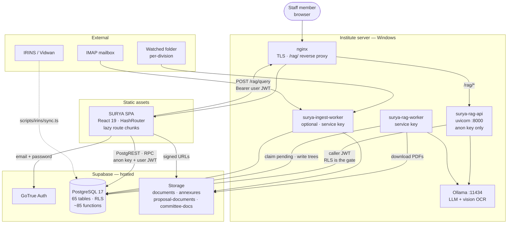

**Trust zones.** The browser is untrusted. `surya-rag-api` is semi-trusted: it handles user
input but holds only the anon key and forwards the caller's JWT, so it cannot read anything
the caller could not. `surya-rag-worker` and `surya-ingest-worker` are trusted: they hold
the service key and bypass RLS, and therefore accept no user input over the network.

---

## 2. Key request flows

### 2.1 Login and role resolution

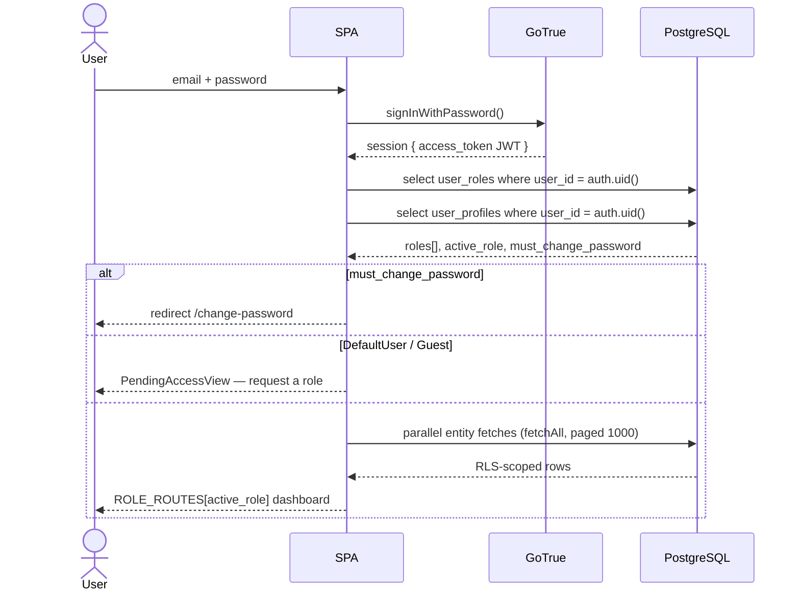

New sign-ups need no manual provisioning: the `handle_new_auth_user` trigger inserts a
`DefaultUser` row in `user_roles` and a `user_profiles` row on every `auth.users` INSERT.

### 2.2 Ask SURYA — a grounded answer

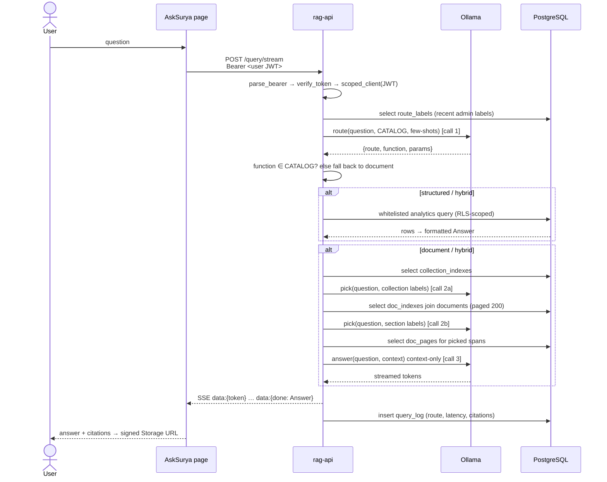

Refusal is the default, not the exception. Any of the following yields the literal string
_"Not found in institute documents."_ with zero citations: no collections picked, no
sections picked, empty context after budgeting, model emits `NOT_FOUND`, or a non-empty
answer somehow carrying no citations. In the streaming path, tokens are buffered while the
accumulated text could still be the `NOT_FOUND` sentinel and only flushed once it cannot be.

### 2.3 Excel/CSV import

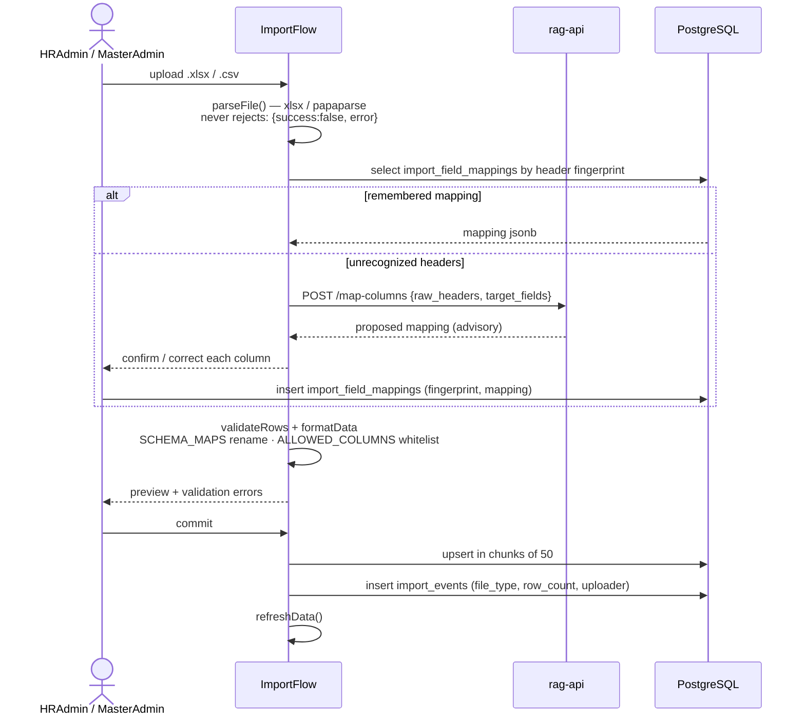

The model's mapping proposal is **advisory only**. Nothing reaches an HR table without a
human confirming the column mapping — the trust boundary is the confirm step, not the
model.

### 2.4 Helpdesk ticket creation and routing

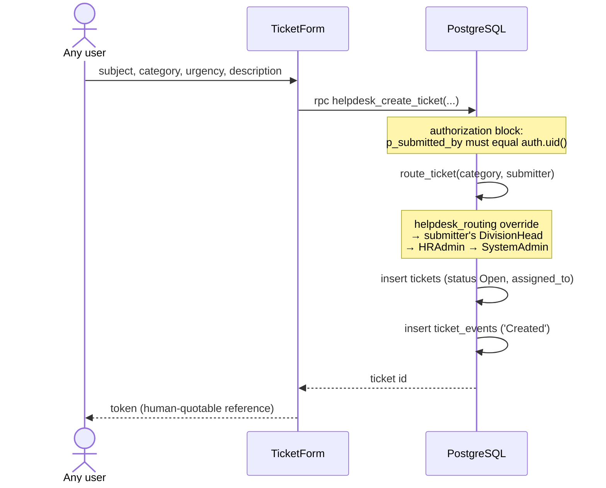

---

## 3. Ingestion and enrichment workflows

### 3.1 Document ingestion (`rag/worker.py`)

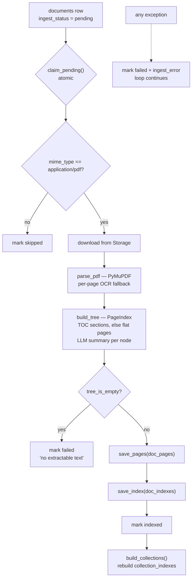

`save_pages` runs before `save_index` deliberately: an indexed document always has its
source pages, so the answer path can never pick a section whose text it cannot fetch.

### 3.2 Capture (`ingest/worker.py`, optional)

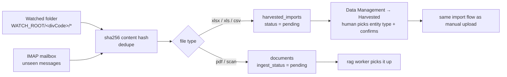

Structured files never auto-commit; documents do, because the corpus is read-only and
RLS-scoped, so the blast radius of a wrong document is zero.

### 3.3 Enrichment

| Enrichment | Mechanism | Cadence |
|---|---|---|
| Node summaries | `llm.summarize` during tree build | Per document, at ingest |
| Collection summaries | `corpus.build_collection_summaries` over root summaries | After any pass that processed documents; or `worker.py --build-collections` |
| Router few-shots | Admin labels a logged query's correct route → `route_labels` → 8 most recent become route-prompt examples | Continuous, admin-driven |
| IRINS profiles | `scripts/irins/sync.ts` → `irins_profiles` keyed by `VidwanID`, logged to `irins_sync_log` | Manual or cron |
| Derived analytics | Pure TypeScript in `src/lib/**` over context data, memoized per page | Per render |

---

## 4. State machines

### 4.1 PMS report — `pms_reports.status`

```mermaid
stateDiagram-v2
  [*] --> DRAFT
  DRAFT --> SUBMITTED: pms_submit_report<br/>(owner; deadline + duty_days checked)
  DRAFT --> NOT_ASSESSED: pms_mark_not_assessed<br/>(duty_days < 90)
  SUBMITTED --> UNDER_EVALUATION_COMMITTEE_REVIEW: pms_assign_evaluators<br/>(admin; panel must be valid)
  UNDER_EVALUATION_COMMITTEE_REVIEW --> EMPOWERED_COMMITTEE_REVIEW: trigger pms_check_evaluation_complete<br/>(all evaluations COMPLETED)
  EMPOWERED_COMMITTEE_REVIEW --> FINALIZED: pms_finalize_report (standard track)<br/>pms_finalize_senior_report (Annexure I/II)
  FINALIZED --> UNDER_GRIEVANCE_REVIEW: pms_submit_representation<br/>(owner, within 15 days of score_communicated_at)
  UNDER_GRIEVANCE_REVIEW --> FINALIZED: pms_resolve_representation<br/>(grievance committee)
  NOT_ASSESSED --> [*]
  FINALIZED --> [*]
```

Rules the machine enforces server-side:

| Rule | Enforced by |
|---|---|
| One report per scientist per cycle | `UNIQUE (cycle_id, scientist_id)` |
| Track is derived, not chosen | `pms_set_report_track` trigger, from `pms_caller_track()` (designation) |
| Deadlines | `pms_deadline(cycle, kind)` → `SELF_APPRAISAL` May 15, `EC_COMPLETION` Jun 30, `EMPOWERED_COMPLETION` Jul 31, `SYSTEM_LOCK` Nov 30 of the cycle end year |
| Absolute lock after Nov 30 | `pms_cycle_locked` + `pms_block_locked_cycle_reports` / `..._children` triggers reject all writes |
| Panel validity | `pms_committee_panel_valid` — odd member count, all three panel roles present |
| Empowered committee validity | `pms_empowered_committee_valid` — 3/5/7 ordinary members, exactly one Chairman |
| Score justification | `CHECK (length(trim(justification)) >= 50)`; ≥90 requires `reasons_for_outstanding`, ≤75 requires `reasons_below_threshold` + `suggestions_for_improvement` |
| Non-submission | `pms_record_non_submission(report, cert_path)` records a certificate and a `system_remark` |

Annexure-I/II reports carry no self score and no AWP; their outcome is a categorical pen
picture finalized by `pms_finalize_senior_report`.

### 4.2 Project proposal — `proposals.status`

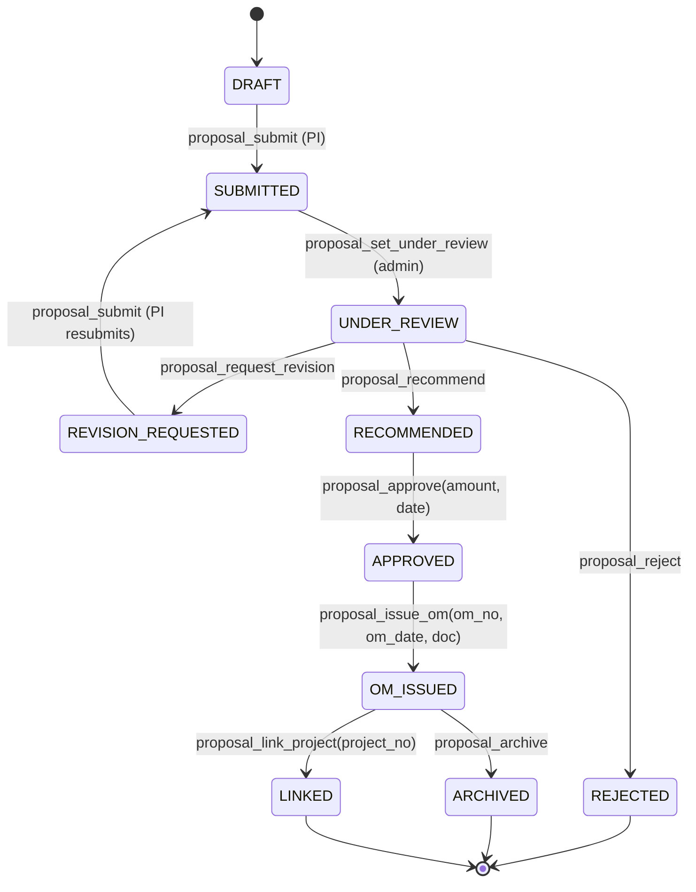

Editable only in `DRAFT` and `REVISION_REQUESTED` (`EDITABLE_STATUSES`). Admin-permitted
next states are declared once in `NEXT_ADMIN_TRANSITIONS`
(`src/lib/proposals/constants.ts`) and mirrored by the RPC guards. Every transition writes
`proposal_status_history` with `from_status`, `to_status`, payload, and actor.

### 4.3 Project progress report — `project_reports.status`

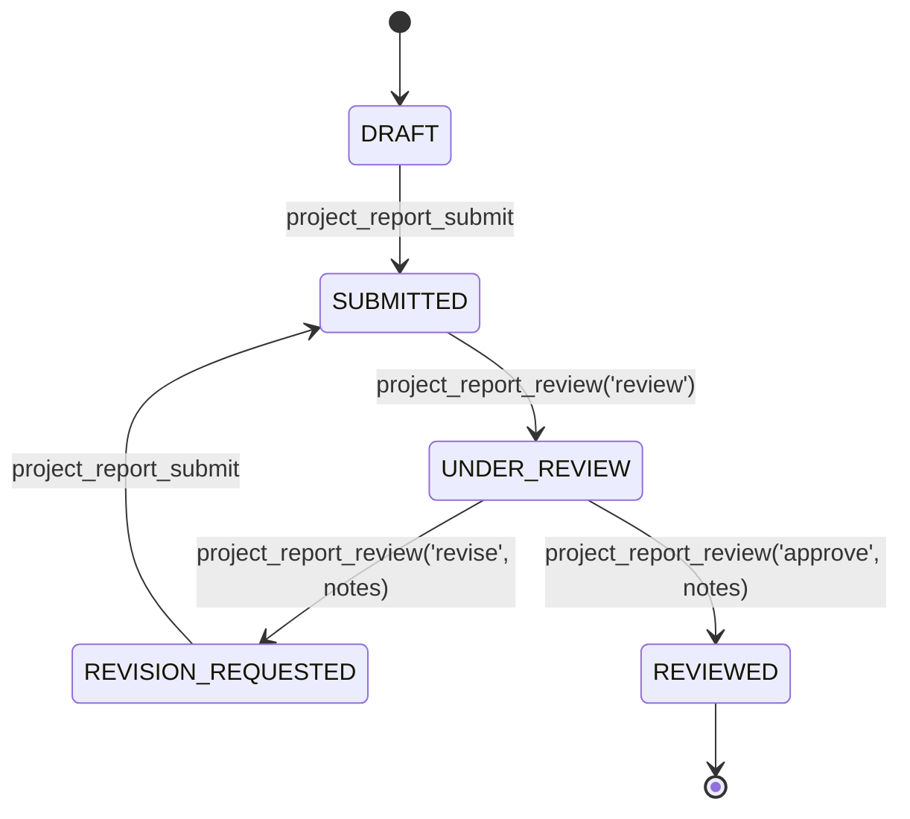

### 4.4 Helpdesk ticket — `tickets.status`

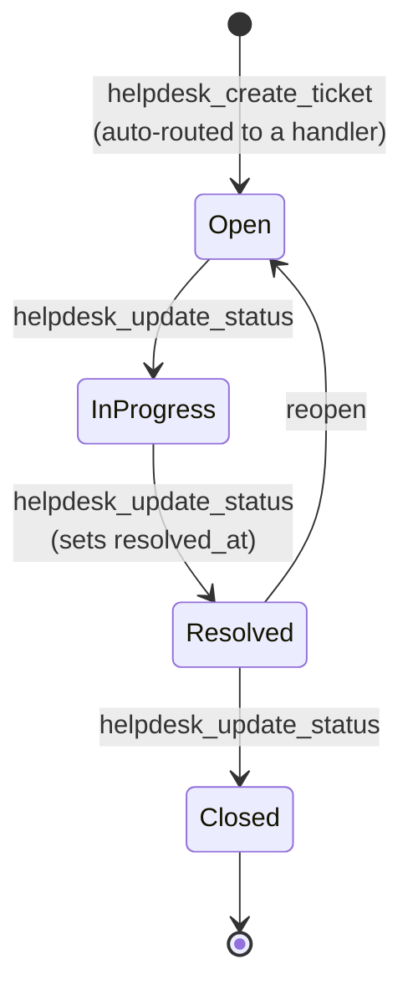

Reassignment (`helpdesk_assign_ticket`) is orthogonal to status. Every transition appends a
`ticket_events` row with the true actor — the RPCs assert `p_actor_id = auth.uid()`, so the
audit actor cannot be forged.

### 4.5 Document ingestion — `documents.ingest_status`

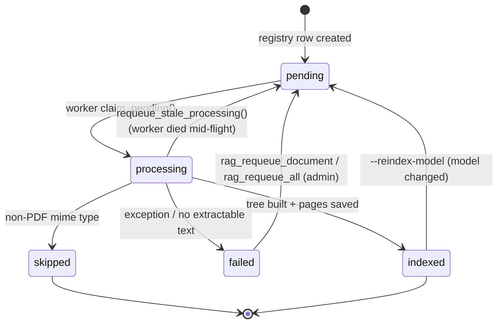

`ingest_attempts` bounds automatic retries at 3; beyond that the document dead-letters in
`failed` until an admin requeues it.

### 4.6 Access request — `access_requests.status`

`PENDING → APPROVED` (`approve_access_request` writes `user_roles`) or
`PENDING → REJECTED` (`reject_access_request` records a note). A partial unique index
(`access_requests_one_pending`) permits exactly one pending request per user.

### 4.7 Harvested import — `harvested_imports.status`

`pending → reviewed` (a human picked the entity type and ran the import) or
`pending → discarded`. Dedupe is a unique index on `content_hash`, so a re-sent mail or a
re-scanned folder cannot create a second row.

---

## 5. Deployment

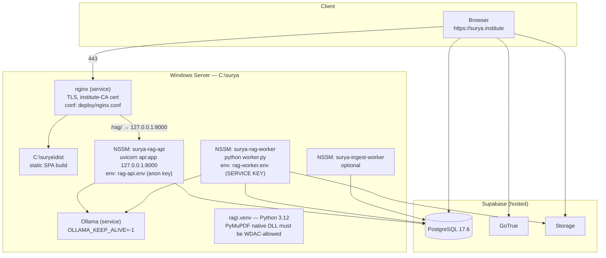

**Environment separation is a security control, not a convenience.** `rag-api.env` holds
the anon key; `rag-worker.env` holds `SUPABASE_SERVICE_KEY`. Both are ACL-restricted to the
service account and live outside the repo. The process that handles user input never holds
the service key.

**Same-origin by design.** nginx proxies `/rag/` under the SPA's own origin, so
`VITE_RAG_URL=/rag` and no CORS is involved in production. `CORS_ORIGINS` exists only for
split-port development.

**Deployment order** (full detail in [deploy/README.md](../../deploy/README.md)):
`supabase db push` → allow native DLLs past WDAC → install Python 3.12 + venv + Ollama +
Tesseract → write env files → `preflight.py --worker` and `--api` (fix every `[FAIL]`) →
NSSM-register both services → `npm ci && npm run build` → copy `dist/` → nginx → smoke
checklist.

**Rollback.** The SPA is static files: keep the previous `dist/` and swap the directory.
Services roll back by pointing NSSM at a previous checkout. Database migrations are
forward-only — a bad migration is corrected by a new timestamped migration, never by editing
or reverting a shipped file.

---

## 6. Failure and recovery

| Failure | Detection | Recovery | Blast radius |
|---|---|---|---|
| Corrupt / unparseable PDF | Exception in `process_document` | `mark failed` + `ingest_error`; loop continues | One document |
| Scanned PDF, OCR disabled | `tree_is_empty` | `mark failed` with an explanatory message | One document |
| Worker crash mid-document | Row stuck in `processing` | Next pass calls `requeue_stale_processing()` | One document, one poll interval |
| Repeated ingest failures | `ingest_attempts` ≥ 3 | Dead-letters; admin requeues from `/admin/rag` | One document |
| LLM host down / slow | `TimeoutError` / `URLError` | `/query` → HTTP 504; `/query/stream` → `data:{error}` | One request |
| Router returns garbage | JSON parse or validation failure | Falls back to the **document** route — the safe branch | One request, degraded not wrong |
| Analytics function errors | `_run_structured` returns `None` | Falls through to the document path; `trace.fallback = true` is logged | One request |
| Retrieval finds nothing | `pick_context` returns `None` | Refusal string, zero citations | One request |
| Query logging fails | Exception in `log_query` | Swallowed — a logging failure must never break an answer | Observability only |
| Supabase unreachable at boot | `try/catch` in loaders | Empty arrays + `EmptyState` `error` variant (Projects / HumanCapital / PhDTracker) | Session |
| React render error | `ErrorBoundary` | App-level fallback UI | Session |
| Result set exceeds the 1000-row cap | Would be silent | Prevented: `fetchAll` pages at exactly `max_rows` | — |
| Late PMS write after Nov 30 | `pms_block_locked_cycle_*` triggers | Write rejected at the database | One write |
| Mail-in loss during an outage | **Known gap** — `mail_source` marks `\Seen` before `land_file` confirms | Re-send the mail; content-hash dedupe prevents duplicates. Tracked in [TODOS.md](../../TODOS.md) | One message |

**Backup.** The database is the sole system of record and is backed up by Supabase's
managed backups; Storage objects likewise. Neither worker holds state — both are pure queue
drainers and can be killed and restarted at any point.

---

## 7. Scaling

**Current envelope.** One institute: hundreds of staff, thousands of projects and outputs,
a document corpus in the tens-to-hundreds. Every design choice below is sized for that, and
the limits are stated so the next engineer knows where they bind.

| Dimension | Current design | Binds at | Next step |
|---|---|---|---|
| Row reads | `fetchAll` pages at 1000, all entities loaded into context at login | Tens of thousands of rows per entity — client memory and boot latency | Move to per-page server-side queries with filters, drop the load-everything context |
| Corpus size | Three-stage descent: collection → document (only past `MAX_DOCS_FLAT = 8`) → section | Thousands of documents make even the collection prompt wide | Multi-level trees (P1) and a fourth stage |
| Answer context | `CONTEXT_BUDGET = 8000` chars split evenly across picked nodes | Long answers truncate evidence | Rank-weighted budgeting instead of even split |
| Inference latency | 3 model calls per question | **This is the real constraint.** Measured CPU-only: `qwen3-vl:8b` ≈ 586 s/question; hosted `deepseek-v4-flash` 7–20 s | Give the model host a GPU. `ollama ps` showing `100% CPU` predicts your latency |
| Retrieval quality | Set by model size, not by prompt tuning | Measured citation hit-rate: `qwen2.5:3b` 0.20; `qwen3-vl:8b` correct with a precise citation; hosted `deepseek-v4-flash` 0.93 → 1.00 across successive runs (`rag/eval/eval_report.md`) | Do not size down to buy speed — benchmark with `rag/eval/bench_local.py` before any model change |
| Ingestion throughput | Single worker, `BATCH_SIZE`, poll loop | Bulk backfill | Ingestion is behind a queue, so a slow model means slower indexing, not failure. Multiple workers are safe — `claim_pending` is atomic |
| Concurrent users | Supabase connection pool; SPA is static | Supabase plan limits | Scale the Supabase plan; the SPA and nginx scale trivially |
| Bundle size | Route-level `React.lazy`; index chunk ≈ 359 KB / 95 KB gz | — | Split admin-only routes (deferred) |

**Deliberately not scaled.** There is no horizontal scaling story for the AI services and
no session affinity to design around — both are stateless, and a second `rag-api` behind
nginx would work today. The reason nobody has is that one institute generates one question
at a time.
