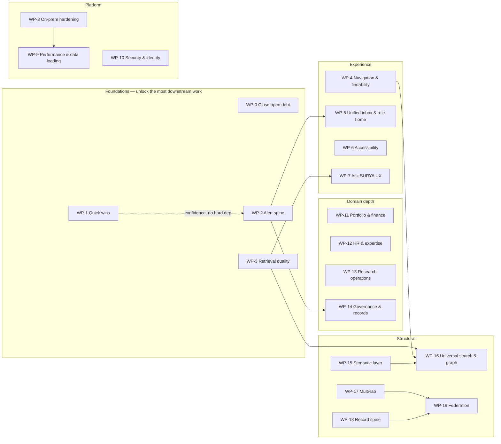

# SURYA — Master Roadmap

_Single planning document. Merges every future-facing proposal in the repo into work
packages that make sense to take up together. Created 2026-08-08._

**Nothing here is scheduled.** There are no dates and no committed order. Pick work
packages in whatever sequence suits you; §7 offers ready-made phase compositions if you
want a starting point, and §6 shows what genuinely blocks what.

**Sources merged** (kept in full under [`sources/`](sources/) — this document is the index
and the frame, they carry the implementation detail):

| Source | Contributes |
|---|---|
| [VISION-ARCHITECTURE.md](VISION-ARCHITECTURE.md) | The north star: four pillars, adoption phases A/B/C, non-goals |
| [sources/FEATURE-IDEAS.md](sources/FEATURE-IDEAS.md) | 36 feature ideas, IDs `A1`–`F7` |
| [sources/improvement-proposals-deepseek.md](sources/improvement-proposals-deepseek.md) | Implementation schemes for those same IDs, plus defer/revisit triggers |
| [sources/IMPROVEMENT-PROPOSALS.md](sources/IMPROVEMENT-PROPOSALS.md) | RAG/retrieval upgrades, IDs `P1`–`P10` |
| [sources/improvement-proposals-grok.md](sources/improvement-proposals-grok.md) | On-prem architecture + navigation/UX/a11y, IDs `A`–`R` |
| [sources/IMPLEMENTATION-PLAN-IMPROVEMENTS.md](sources/IMPLEMENTATION-PLAN-IMPROVEMENTS.md) | Phase 0–10 breakdown with acceptance criteria for the grok items |
| [sources/AHEAD-INTELLIGENCE-MASTER.md](sources/AHEAD-INTELLIGENCE-MASTER.md) | Semantic-layer architecture, IDs `R1`–`R5`, guardrails |
| [sources/INTELLIGENCE-PHASES.md](sources/INTELLIGENCE-PHASES.md) | Executable phase breakdown for `R1`–`R5` |
| [../history/ARCHITECTURE-REMEDIATION.md](../history/ARCHITECTURE-REMEDIATION.md) | The three audit items still open |
| [../../TODOS.md](../../TODOS.md), [../../CLAUDE.md](../../CLAUDE.md) | Open hardening and deferred debt |

**Original IDs are preserved throughout** so any item traces back to its source brief. A
source brief is still the thing to hand to an implementation session — this document tells
you *which* briefs belong together and *why*.

---

## 1. How to read this

**Work package (WP).** A batch of items that share a foundation, a file surface, or a
dependency — cheaper and safer done together than scattered. This is the unit to pick up.

**Status.**

| Mark | Meaning |
|---|---|
| ◇ | Open — nothing built |
| ◐ | Partial — some of it shipped, remainder specified |
| ⛔ | Blocked — see the named blocker |
| ⏸ | Deferred with a stated revisit trigger |

**Effort.** `S` ≈ half a day · `M` ≈ 1–2 days · `L` ≈ 3+ days · `XL` ≈ multi-week.
These are the source docs' own estimates, not re-derived.

**Horizon.** `H1` harden the pilot · `H2` lab-wide record spine · `H3` CSIR network.
Maps to VISION-ARCHITECTURE §9 phases A/B/C.

**Pillar.** Which vision pillar the work advances: **Keep** (capture), **Find**
(retrieval), **Reach** (accessibility), **Trust** (preservation & integrity), or
**Base** (platform work serving all four).

---

## 2. Standing constraints

Every item below is subject to these. An item that violates one is wrong, however
valuable it looks. Drawn from VISION-ARCHITECTURE §2/§11 and AHEAD-INTELLIGENCE-MASTER
§8–§11.

1. **Capture as a by-product of work.** If a feature needs someone to retro-file, redesign
   it. The workflow *is* the record.
2. **RLS stays the only hard gate.** No feature adds a second authorization path.
3. **No free-form SQL from a model.** Structured answers execute whitelisted catalog
   functions only.
4. **The grounding invariant is untouchable.** An answer cites its sources or it is the
   refusal. No feature introduces an ungrounded generation path.
5. **Provenance on every output** — record → version → page → creator, for human search,
   AI answer, and export alike.
6. **One record, one home, one ID.** No parallel copies.
7. **Federation, never centralisation** across labs.
8. **Server-side state transitions.** New workflows get RPCs, not client status writes.
9. **Monitoring, not optimisation.** The system informs decisions; it does not make or
   optimise allocations. (This is a deliberate boundary the dissertation states — crossing
   it invites a question the project has disclaimed.)
10. **Every schema change is append-only and CLI-applied.**

---

## 3. Work package map

---

## 4. Work packages — Horizon 1 (harden the pilot)

### WP-0 — Close the open debt ◐ · Base · effort S–M

The cheapest work in this document, and it removes footguns everything else would trip on.

| ID | Item | Effort | Source |
|---|---|---|---|
| A7.1 | **Get the CI `db` job green.** The RLS suite is wired but has never actually executed. Until it runs, the policy tests are decoration | S | ARCHITECTURE-REMEDIATION |
| A3b | **Drive `admin_staff_link_gaps()` to zero**, then delete the name-string fallback in the staff-linking path | M | ARCHITECTURE-REMEDIATION |
| A2 | **Finish aggregate pushdown** — continue moving per-page aggregation from the browser to SQL, page by page | M (ongoing) | ARCHITECTURE-REMEDIATION |
| — | **Mail-in ack-after-land.** `ingest/mail_source.py` marks a message `\Seen` before `land_file` confirms; a Storage outage silently drops that mail | S | TODOS.md |
| — | **`EmptyState` error-variant rollout** beyond Projects / HumanCapital / PhDTracker | S | CLAUDE.md deferred |
| — | **Code-split admin-only routes** (`/data`, `/pms/audit`, `/audit`) | S | CLAUDE.md deferred |
| — | **Shrink `eslint.design-debt.json`** — 107 files at the ratchet; the list may only go down | S (ongoing) | eslint config |

**Take it up when:** any time. Good filler between larger packages.

---

### WP-1 — Quick wins ◇ · mixed · effort S each, ~1 week total

Seven independent S-sized items. No dependencies, no schema risk, all visible. Deepseek
calls this "Wave 0"; FEATURE-IDEAS' recommended-top-10 overlaps heavily. Worth doing as a
batch because the momentum is the point.

| ID | Item | Pillar | Where |
|---|---|---|---|
| E1 | **Decision-brief export** — one-click PDF of any Ask SURYA answer with citations. The "evidence pack" output | Reach | `AskSurya.tsx` + `@react-pdf/renderer` (already a dependency) |
| F1 | **Import history & diff UI** — surface `import_events` with rows added/updated/failed | Trust | `DataManagement.tsx` |
| C5 | **Patent annuity/renewal tracker** — the IP register exists; the deadlines don't | Keep | `Intelligence.tsx` IP tab |
| B1 | **Division expertise matrix** — topic × division coverage heatmap; pairs with succession risk | Find | `Intelligence.tsx` / `DivisionsAnalytics.tsx` |
| F5 | **Export any analytics view** — shared `exportAnalytics.ts` (CSV via `xlsx`, PDF via react-pdf), button on every analytics header | Reach | shared util |
| B4 | **Staff profile self-service** — `update_own_profile` RPC, owner-only fields, audit row. Directly improves expertise-search quality | Keep | `StaffDetail.tsx` |
| E5 | **Related-question chips + confidence badge** — ship alongside E1 | Find | `AskSurya.tsx` |

**Take it up when:** you want visible progress cheaply, or to warm up on the codebase.

---

### WP-2 — The alert spine ◇ · Base/Keep · effort M, foundation for three others

Today only `pms_notifications` exists. **A1 generalizes it into one cross-module alerting
mechanism**, and once it exists, D1, E4 and much of WP-14 become small.

| ID | Item | Effort | Notes |
|---|---|---|---|
| A1 | **Exception-alert engine** — one `notifications` table + rule evaluation for budget variance, AMC/MoU expiry (90-day), PhD overdue, report dues, PMS deadlines. Surfaces in My Actions + a bell | M | The single highest-leverage item in this document |
| D1 | **Email notifications** — worker/edge-function SMTP hook reading open alerts at severity ≥ warning → daily digest | M | Needs A1 |
| E4 | **Scheduled briefs** — `scheduled_queries(owner, query, cron)` + worker mode running `/query` and posting to alerts/email | M | Needs A1 + D1 |

**Why together:** D1 and E4 are thin wrappers on A1's data model. Building A1 without them
leaves the value half-collected; building them without A1 means three ad-hoc mechanisms.

**Take it up when:** operational adoption matters more than analytics depth. This is what
makes the system nag people usefully instead of waiting to be visited.

---

### WP-3 — Retrieval quality ◐ · Find · effort M–L

The RAG upgrade ladder. **Order matters here more than anywhere else in this document**,
and P10 comes first because it is the yardstick for everything after it.

| ID | Item | Status | Effort |
|---|---|---|---|
| P10 | **Gold-set authoring on real documents** — 25–50 `{question, expected_citation}` cases authored with a scientist, then `run_eval.py` | ◐ partial — `gold.jsonl` has 58 router cases; citation and duplication sets are thin | an afternoon, mostly human |
| P1 | **True hierarchical PageIndex trees** — multi-level from the full TOC, bottom-up summaries, depth cap 3, fan-out ~10; recursive descent in `retrieval.py`; bump `tree_version` so flat trees still traverse | ◇ trees are still one level deep | ~2 sessions |
| P2 | **Answer from source page text** | ✅ **shipped** — `doc_pages` + `CONTEXT_BUDGET` | — |
| P3 | **Conversation memory** | ✅ **shipped** — `history` param, 3 turns | — |
| P4 | **Collection-stage traversal** | ✅ **shipped** — `select_corpus` | — |
| P5 | **Ingest retry / dead-letter / re-index** | ✅ **shipped** — `ingest_attempts`, `--reindex-model`, requeue RPCs | — |
| P6 | **Router feedback loop** | ◐ `route_labels` + few-shots shipped; the nightly job and per-release accuracy tracking are not | S |
| P8 | **pgvector hybrid retrieval** | ⏸ deferred by design | ~2 sessions + infra |
| P9 | **Latency budget + streaming** | ✅ **shipped** — per-stage timeouts, SSE. Latency percentile chart in RagMonitor still open | S for the chart |
| — | **M4b duplication precision** — measured 0.38–0.41 against a 0.60 target. Recall (0.90) and citation hit-rate (0.93–1.00) are met | ◇ | M |

**Revisit trigger for P8:** only if P1 lands and paraphrase-heavy queries still miss. Do
not start it before P10 produces a real number — the original plan deferred it explicitly
and that judgement still holds.

**Take it up when:** answer quality is the complaint, or before any model change.

---

### WP-4 — Navigation & findability ◇ · Find · effort M–L

Grok's Tier 1 A/B and Tier 2 F/G/H/I/J, sequenced by IMPLEMENTATION-PLAN phases 0, 1, 4.
One coherent product milestone: *you can get anywhere, and a URL means something.*

| ID | Item | Effort |
|---|---|---|
| Phase 0 | **Shared primitives** — the small components every later item needs (breadcrumb, page-header, filter-chip contracts) | S–M |
| A | **Command palette → jump-anywhere hub** — entities, not just routes; recent items; role-scoped results | M |
| B | **Breadcrumbs + "you are here"** page titles | S |
| F | **URL-synced list filters** (`?div=&status=`) + clear chips — shareable lists, working back button | M |
| G | **Standard dossier layout** on every detail page: header · KPIs · tabs · Connections · documents. `EntityLink`/`RelatedRail` are not universal today | M |
| H | **Explore Graph anchoring** — entry from the current entity, legend, keyboard select, role-scoped nodes | M |
| I | **Contextual Ask SURYA** — "Ask about this project" from a dossier. `/ask` is an island today | S–M |
| J | **Sidebar polish** — section-collapse memory, pinned favourites, pending badges, mobile search | S |

**Why together:** F and G share the dossier surface; A and I both need entity resolution;
all of them depend on Phase 0's primitives. Done separately you build the primitives three
times.

**Take it up when:** users say they can't find things — the most common complaint in a
33-route app.

---

### WP-5 — Unified inbox & role home ◇ · Reach · effort M

| ID | Item | Effort | Notes |
|---|---|---|---|
| C | **Unified Inbox** — one queue merging PMS actions, proposal revisions, report dues, committee action items, helpdesk tickets, access requests | M | Much cheaper after **WP-2 A1** |
| E | **Role-first home** — the landing page leads with what this role does today, not with generic KPIs | M | |
| R | **Multi-role clarity** — "Now acting as HOD" toast after a switch; quick actions for the secondary role | S | |
| F7 | **Role-home customization** — admins choose which widgets each role sees; extends `/admin/features` | M | |

**Take it up when:** after WP-2, or before it if you want the inbox to aggregate what
already exists.

---

### WP-6 — Accessibility baseline ◇ · Reach · effort M–L

IMPLEMENTATION-PLAN Phase 3 plus grok D. Standalone, overlappable with anything.

Keyboard reachability on every interactive control · visible focus rings · form labels and
`aria-describedby` on errors · live-region announcements for async results · contrast
audit against DESIGN.md tokens · `prefers-reduced-motion` honoured in framer-motion ·
K: calendar list view (month grids are hard for daily and assistive-tech use).

**Why standalone:** it touches every component but conflicts with nothing. Good background
work.

**Take it up when:** before any institute-wide rollout — a government deployment will be
asked about WCAG.

---

### WP-7 — Ask SURYA experience ◇ · Find/Reach · effort S–M

| ID | Item | Effort | Notes |
|---|---|---|---|
| E2 | **Chart answers** — structured/hybrid answers render a chart beside the number | M | Touches `rag/`; run `run_eval.py --report` before and after to prove no regression |
| E3 | **Pinned queries as dashboard widgets** — save to `user_preferences` (table exists), render as role-dashboard cards | S–M | |
| D4b | **Helpdesk knowledge base** — resolved tickets promoted to a `faq` table, searchable via the document path with an `entity_type` filter | M | Pairs with WP-14's D4a |

Depends on **WP-3** only in the sense that answer quality gates perceived value here.

---

### WP-8 — On-prem hardening & observability ◇ · Base/Trust · effort L

Grok §3–§5, IMPLEMENTATION-PLAN phases 5, 6, 10. The package that turns a working
deployment into an operable one.

| Area | Items |
|---|---|
| **nginx** | Security headers, TLS policy, rate limits, request-size caps, access-log format beyond the current minimal conf |
| **Host OS** | Service account hardening, WDAC allowlist documented as configuration rather than tribal knowledge, disk/backup layout |
| **LLM host** | vLLM vs Ollama evaluation, GPU sizing, model pinning + a recorded eval run per pinned model |
| **Config lock** | Secrets out of every reachable path, `supabase config push` as a release step, environment parity checks |
| **Observability** | Structured logs off stdout into something queryable; latency and error dashboards; health endpoints; alert on worker death |
| **Release gates** | `preflight.py`, `check_security_definer.py`, `run_eval.py`, and the RLS suite promoted from "scripts that exist" to "gates that block" |
| **Staging go-live gate** | A staging environment and a documented cutover checklist |
| **Backup runbook** | `pg_dump` + storage paths + a rehearsed restore drill |

**Take it up when:** before the institute depends on it daily. Today's single-server
deployment has no alerting — a dead worker is discovered by someone noticing.

---

### WP-9 — Performance & data loading ◐ · Base · effort M

IMPLEMENTATION-PLAN Phase 7 plus grok P, continuing ARCHITECTURE-REMEDIATION A2.

Lazy per-domain `DataContext` loading instead of loading every entity at login ·
layout-stable skeletons · optional `EntityLink` prefetch · continue aggregate pushdown into
SQL · Q: honest connectivity banners when Supabase/RAG/LLM is down, with Ask disabled and a
stated reason.

**The structural point:** the SPA composes the whole institute in the browser. That is fine
at 107 staff and 82 projects and will not be at ten times that. This package is where that
gets addressed — and it is the natural prerequisite for **WP-17**.

---

### WP-10 — Security & identity ◇ · Trust · effort M–L

| ID | Item | Effort | Status |
|---|---|---|---|
| F6 | **2FA (TOTP) for admin roles** — enrollment QR, verify at login, secret per admin | M | ◇ |
| D6 | **DSC / e-signature on PMS finalization** | L | ⏸ external vendor + procurement. Revisit when PMS goes institute-wide formal |
| — | **Self-hosted GoTrue** if the institute requires auth on-premise too | L | ⏸ grok §3.3 — only if hosted Supabase Auth becomes unacceptable |

---

## 5. Work packages — Horizon 1–2 (domain depth)

### WP-11 — Portfolio & finance ◇ · Find · effort M–L

| ID | Item | Effort | Status |
|---|---|---|---|
| C1 | **Project health score** — composite traffic-light: burn vs plan, milestone delay, report compliance, utilisation; rolled up on the Director dashboard | M | ◇ — the single most decision-support visual available |
| A2 | **Portfolio risk view** — sanctioned-vs-utilised scatter (bubble = duration), sponsor/division concentration, fund-type mix | M | ◇ pure frontend over existing data |
| A3 | **Utilisation S-curves** — cumulative burn vs elapsed fraction with expected-burn bands | M | ⛔ honest "no data" state until F&A utilisation lands |
| A5 | **PFMS / F&A auto-ingest** — monthly expenditure export through the existing column-mapping machinery | M | ⏸ blocked on an export existing. The day it does, this is routine |
| A4 | **What-if allocation simulator** | L | ⏸ **deliberately deferred** — crosses the monitoring-not-optimisation boundary in §2.9. Revisit only if the Director explicitly asks |

**Dependency reality:** A3 and A5 are gated on data that does not exist yet. C1 and A2 are
not — build those two, leave the placeholders honest.

### WP-12 — HR & expertise ◇ · Keep/Find · effort S–M

| ID | Item | Effort |
|---|---|---|
| B2 | **Workforce planning simulator** — age pyramid + retirement-wave projection from `getRetirementDate`, "hire N/year" slider | M |
| B3 | **Scientist workload view** — active projects, PI/Co-PI split, sanctioned value managed, overload flag (>4 active) | S–M |
| B5 | **Public staff profile pages** — read-only external view; a first step toward the transparency portal | S |

B1 and B4 are in **WP-1**. B5 is the natural on-ramp to **WP-14's** transparency work.

### WP-13 — Research operations ◇ · Keep · effort M–L

| ID | Item | Effort | Status |
|---|---|---|---|
| C3 | **Proposal evaluation rubric** — weighted criteria, evaluator comments, score roll-up through the review chain | M | ◇ makes the proposal workflow read like real underwriting |
| C2 | **Project milestones / Gantt** — reuse the `PhDMilestonePanel` pattern; `project_milestones` table; slippage flags | M | ◇ |
| C4 | **Output ↔ project linkage** — `scientific_outputs.project_id`, per-project output impact | M | ◇ |
| C6 | **Equipment booking calendar** | L | ⏸ no booking pain reported. Revisit when a technician or facilities head asks |
| C7 | **Equipment utilisation logging** | S–M | ⏸ adoption is weak without C6 — do them together or not at all |

C2 feeds C1's milestone-delay input, so **WP-11 C1 + WP-13 C2 pair naturally.**

### WP-14 — Governance & records ◇ · Trust/Keep · effort S–M

| ID | Item | Effort |
|---|---|---|
| F3 | **Record-level change history** — the global audit exists; filter it per record on detail pages | S–M |
| D3 | **Audit export packs** — filterable compliance exports per module | S |
| D5 | **Decision → action closure analytics** — committee decisions to action items, closure rate and aging | S |
| D2 | **Document versioning + sign-off** — `documents.version` / `supersedes`, version history with access-tier checks | M |
| D4a | **Helpdesk SLA** — `sla_due_at` by category, aging strip in the ticket list | M |
| F2 | **Bulk edit + duplicate detection** — selection-mode bulk update RPC; fuzzy name/email flags at import | M |
| F4 | **Per-division data quality scorecards** — extend `DataHealthDigest` with per-division completeness and freshness | S |
| M | **Import guidance** — "what to upload next" from the health digest; freshness on empty lists; 5-row preview before commit | S |
| N/O | **Helpdesk and committee defaults** — default to *mine*; "meetings this week" on home; Kanban defaults to my cards | S |

**Why together:** every one of these is a small surfacing of data the system already holds.
Batched, they read as a single "the system now shows its work" release.

---

## 6. Work packages — Horizon 2–3 (structural)

### WP-15 — Semantic layer ◇ · Find · effort XL

The AHEAD-INTELLIGENCE-MASTER programme. **L4 is the layer that does not exist** —
everything else in that architecture already does. Phase detail in
[sources/INTELLIGENCE-PHASES.md](sources/INTELLIGENCE-PHASES.md).

| ID | Item | Phase |
|---|---|---|
| R3 | **Proactive executive digest** — deterministic, zero LLM | 1a ★ start here |
| R5 | **Entity layer for Ask** — resolved entities, not free-text matching | 1a ★ |
| — | **Production gate (D6)** | 1b ⛔ **blocker for everything after** |
| R1 | **Semantic business layer** — metric registry + catalog expansion; one governed definition per metric | 2 |
| R4 | **Institutional memory** — verified answers, curated and reusable | 3 |
| R2 | **Dashboard-embedded copilot** — "Explain this" with a context envelope | 4 |
| — | **Maturation** — scope decided at entry, evidence-driven | 5 |

**Read the guardrails in AHEAD-INTELLIGENCE-MASTER §9 before starting.** They are
mechanical checks, and the programme's own rule is that each phase gets its own executable
task plan before implementation.

### WP-16 — Universal search & knowledge graph ◇ · Find · effort XL

VISION §4. Needs **WP-4** (entity resolution) and **WP-15** (controlled vocabulary).

One query across people, projects, documents, datasets, equipment, samples — faceted, not
per-module · entity-resolved graph browsing (`/explore` is the seed) · point-in-time recall
("what did the institute know about X in 2019?") from version history · figure-level
retrieval inside micrographs, charts, spectra · **controlled vocabularies as a governed
object** — label drift between labs is the silent killer of network-wide retrieval, so this
one is a prerequisite for WP-19, not a nicety · saved searches, topic alerts, watched
entities.

### WP-17 — Multi-lab scalability ◇ · Base · effort L–XL

`P7` plus [../superpowers/2026-07-07-multi-lab-design.md](../superpowers/2026-07-07-multi-lab-design.md).

`labs` table + `lab_code` on `documents`, `divisions`, and new entities, with an `'AMPRI'`
backfill so nothing breaks · RLS policies gain a lab predicate · `user_profiles.lab_code` ·
per-lab collections · cross-lab queries as a Director/HQ capability.

**Write the design doc first.** This is a coordinated DB + RLS + UI change of the same class
as the HR column-casing debt — the kind that goes wrong when started as a migration.

### WP-18 — The record spine ◇ · Keep/Trust · effort XL

VISION §3, adoption Phase B. The largest body of work in this document, and the one that
turns SURYA from a management portal into an institutional record system.

| Capability | Note |
|---|---|
| **Project master file (e-file)** | Sanction, revisions, extensions, fund releases, progress reports, final report, utilisation certificate, audit notes in one chronology. **The highest-priority capture target** — today the institute's most valuable record is spread across email and paper |
| **Patent prosecution file** | Disclosure → prior-art → filing → office actions → responses → grant → annuity → licensing, every step dated. Today run from IP officers' personal spreadsheets. C5 in WP-1 is the first slice |
| **Digital lab notebook (ELN)** | Timestamped, versioned, witness-signed; mandatory metadata: project, instrument, material batch, personnel |
| **Dataset registry (FAIR)** | DMP per project, stable dataset IDs, embargoes, links to the publication or patent they underpin; "no data, no final report" as a workflow rule |
| **Sample & material registry** | Sample IDs with synthesis route, parameters, storage, disposal; chemical inventory tied to safety |
| **Instrument run records** | Auto-logged operator, time, parameters, linked to notebook entries |
| **Publication workflow file** | Draft → internal review → originality/IP check → submission → acceptance, all versions retained |
| **Thesis records** | Synopsis reviews, examiner reports, viva minutes, conferral, open-access repository |
| **Retention & disposal schedules** | Per Indian public-records rules: hot/warm/cold tiers, authorised disposal with an audit trail |
| **Tamper-evident audit** | Append-only / hash-chained notebooks, minutes, appraisal outcomes |
| **Format preservation** | PDF/A at ingest, legacy migration |
| **Cross-site backup** | Irreplaceable data replicated off one lab's server |

**Sequencing within WP-18:** project master file → patent prosecution file → everything
else. The first two are extensions of what exists; the rest are new subsystems.

### WP-19 — Federation & external reach ◇ · Reach · effort XL

VISION §5/§7, adoption Phase C. Needs **WP-16** and **WP-17**.

Secure external sharing (expiring links, watermarked PDFs, download controls, NDA-aware
defaults — replacing email attachments, today's biggest uncontrolled record leak) ·
public transparency portal generated from the same governed repository · auditor/funder
read-only exportable views, PFMS/CAG-ready, with utilisation-certificate generation · open
APIs for ERP/eHRMS/IRINS/PFMS interchange · mobile secure read access · federation layer for
cross-lab duplication checks and expertise discovery · network expertise directory · one
shared ontology with visible local extensions.

`E6` **Hindi interface (i18n)** belongs here too — ⏸ deferred, large perpetual surface, no
user request yet. Revisit when a Hindi-first user group is identified.

---

## 7. Ready-made phase compositions

Menus, not a schedule. Each is internally coherent and independently shippable.

| Composition | Contents | Delivers |
|---|---|---|
| **"Warm-up"** | WP-1 entire, plus WP-0's CI and mail-in items | Seven visible features and a green policy gate, in about a week |
| **"Operational"** | WP-2 → WP-5 | The system starts telling people what needs doing instead of waiting to be visited |
| **"Answers"** | WP-3 (P10 → P1 → P6) → WP-7 | Measured retrieval quality, then the UX that shows it off |
| **"Wayfinding"** | WP-4 → WP-6 | Get anywhere, share a URL, use it with a keyboard |
| **"Production-ready"** | WP-8 → WP-9 → WP-10 (F6) | Safe to hand to the institute unattended |
| **"Decision support"** | WP-11 (C1 + A2) + WP-13 (C2 + C3) | The Director's cockpit becomes genuinely evaluative |
| **"Show your work"** | WP-14 entire | Every record explains its own history — the strongest audit story |
| **"Next dissertation"** | WP-15 or WP-17 or WP-18 | Each is a research-scale project on its own |

**If you want one recommendation:** WP-1, then WP-2, then WP-0's CI item. That is the
cheapest path to a system that visibly earns its keep, and it leaves every other door open.

---

## 8. Deferred, with revisit triggers

Not rejected — waiting on a specific signal. Recorded so nobody re-litigates them, and so
nobody forgets them either.

| Item | Waiting on |
|---|---|
| `P8` pgvector hybrid | P1 shipped **and** paraphrase queries still missing on a measured gold set |
| `A4` what-if simulator | The Director explicitly asking for scenario analysis. Crosses the monitoring/optimisation boundary |
| `A5` PFMS auto-ingest | An F&A or PFMS export existing. Then it is routine — same machinery as Data Management |
| `A3` utilisation S-curves | Real utilisation figures. Render an honest empty state until then |
| `C6`+`C7` equipment booking & logging | A technician or facilities head asking. Do both or neither |
| `D6` DSC e-signature | PMS going institute-wide formal; needs vendor procurement |
| `E6` Hindi i18n | An identified Hindi-first user group |
| Self-hosted GoTrue | Hosted Supabase Auth becoming unacceptable to the institute |

---

## 9. Non-goals

Standing boundaries. Restating them here so a roadmap item never quietly crosses one.

- Not a payroll or finance system of record — no money moves through SURYA.
- No replacement of ERP/eHRMS transaction processing; records interchange only.
- No autonomous decisions or allocation optimisation.
- No real-time streaming — the system operates on governed, periodically ingested records.
- No centralising records across labs. Federation only.
- No server-rendered pages, no Node API tier, no `BrowserRouter`.
- Nothing that weakens the grounding invariant, the whitelist-only analytics rule, or
  record-level governance.
- Not a general document management system — `documents` is a registry and ingest queue.
- No native mobile app; the SPA is responsive and mobile access is read-only (WP-19).

---

## 10. Success criteria for the whole programme

From VISION §10. These are what "done" eventually means — useful as a sanity check on
whether a work package is actually moving the system toward anything.

1. A scientist can reconstruct, in minutes, the full evidence trail of any published claim
   from her lab: notebook → data → instrument log → sample → publication.
2. An auditor can extract a project's complete official file in two clicks.
3. A proposal can be checked against the entire network's prior work before sanction, under
   entitlement, with citations.
4. External partners receive governed, expiring, watermarked access — no email attachments.
5. Records survive staff retirement, format migration, and site failure without loss.
6. The system requires no scientist to do extra filing work.

---

## 11. Document history

| Date | Change |
|---|---|
| 2026-08-08 | Created. Merged nine future-facing documents into 20 work packages. Original item IDs preserved; source documents retained under `sources/`. Marked `P2`/`P3`/`P4`/`P5`/`P9` as shipped after verifying against the code — the source brief still lists them as proposals. |
